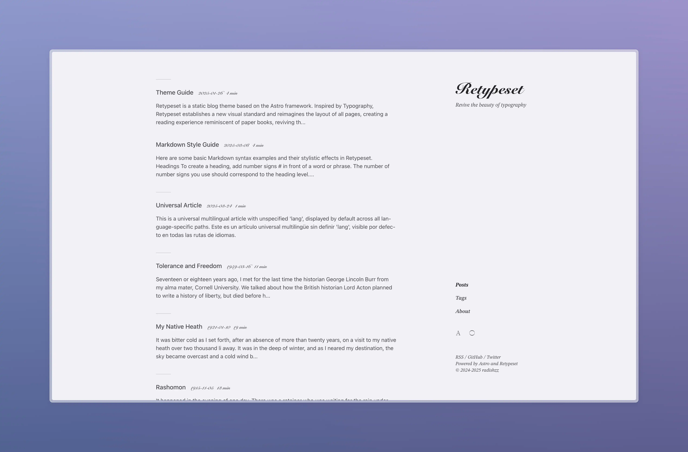
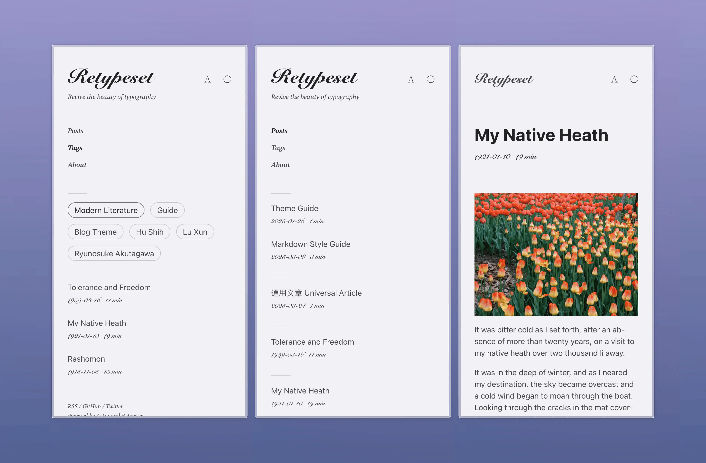

# Retypeset




[简体中文](assets/docs/README.zh.md)｜[繁体中文](assets/docs/README.zh-tw.md)｜[日本語](assets/docs/README.ja.md)｜[Español](assets/docs/README.es.md)｜[Français](assets/docs/README.fr.md)｜[Русский](assets/docs/README.ru.md)

Retypeset is a static blog theme based on the [Astro](https://astro.build/) framework. Inspired by [Typography](https://astro-theme-typography.vercel.app/), Retypeset establishes a new visual standard and reimagines the layout of all pages, creating a reading experience reminiscent of paper books, reviving the beauty of typography. Details in every sight, elegance in every space.

## Demo

- [Retypeset](https://retypeset.radishzz.cc/en/)
- [Retipografía](https://retypeset.radishzz.cc/es/)
- [Переверстка](https://retypeset.radishzz.cc/ru/)
- [重新编排](https://retypeset.radishzz.cc/)
- [重新編排](https://retypeset.radishzz.cc/zh-tw/)
- [再組版](https://retypeset.radishzz.cc/ja/)

## Features

- Built with Astro and UnoCSS
- Support for SEO, Sitemap, OpenGraph, RSS, MDX, LaTeX, Mermaid, and TOC
- i18n support *(本站当前已禁用，见下文)*
- Light / Dark mode
- Elegant view transitions
- Rich theme customization
- Optimized typography
- Responsive design
- Comment system

## 本项目自定义（Project Customizations）

本仓库基于上游主题 [radishzzz/astro-theme-retypeset](https://github.com/radishzzz/astro-theme-retypeset) 搭建。

### 功能裁剪（注释保留，可随时恢复）

均以注释方式保留原代码，详见 [note/disabled-features.md](note/disabled-features.md)：

- **禁用多语言切换**：仅生成中文页面。实测构建页面数 103 → 18（-83%）、构建时间约 -50%，见 [性能实测报告](note/report/perf/2026-09-27-i18n-sound-disable-verification.md)。
- **禁用界面音效**：页面加载不再预载 10 个音效 WAV 文件。

### 构建与部署优化

- **构建期字体移出部署产物**（v1.0.2）：OG 图渲染专用的 16MB NotoSansSC OTF 从 `public/` 迁至 `src/assets/fonts/`，部署产物字体体积 21MB → 4MB。
- **构建命令瘦身**（v1.0.2）：`astro check` 从 dev/build 拆出为独立 `pnpm check`（在 CI 中执行）；移除与 Astro/Vite 默认压缩重复的 `astro-compress`。
- **KaTeX 样式按需加载**（v1.0.3）：数学样式表仅注入带 `math: true` frontmatter 的文章页。**写作须知：含数学公式的文章需在 frontmatter 中加 `math: true`**。
- **og:image 静态化**（v1.0.3）：非文章页分享图统一使用构建期生成的 `/og/home.png`，已移除 apiflash 第三方截图回退（含上游主题遗留的硬编码 key）。
- **CI 门禁**（v1.0.3）：GitHub Actions 双 job（lint + typecheck / build），见 `.github/workflows/ci.yml`。

版本履历见 [note/release/](note/release/)；性能分析与优化建议见 [note/report/perf/](note/report/perf/)。

主题本身的完整功能说明与使用文档见上方各语言 README 及上游仓库。

## Performance

<br>
<p align="center">
  <a href="https://pagespeed.web.dev/analysis?url=https%3A%2F%2Fretypeset.radishzz.cc%2Fen%2F&form_factor=desktop">
    
  <a>
</p>

## Getting Started

1. [Fork](https://github.com/radishzzz/astro-theme-retypeset/fork) this repository, or use this template to create a new repository.
2. Run the following commands in your terminal:

   ```bash
   # Clone the repository
   git clone <repository-url>

   # Navigate to the project directory
   cd <repository-name>

   # Install pnpm globally (if not already installed)
   npm install -g pnpm

   # Install dependencies
   pnpm install

   # Start the development server
   pnpm dev
   ```

3. Refer to the [Theme Guide](https://retypeset.radishzz.cc/en/posts/theme-guide/) to customize your blog and create new posts.
4. Refer to the [Astro Deployment Guides](https://docs.astro.build/en/guides/deploy/) to deploy your blog to Netlify, Vercel, or other platforms.

&emsp;[](https://app.netlify.com/start) [](https://vercel.com/new)

## Updates

Retypeset releases [new features](https://github.com/radishzzz/astro-theme-retypeset/issues/18) from time to time. Simply run `pnpm update-theme` to update the theme. If you encounter merge conflicts, please refer to [this video](https://youtu.be/lz5OuKzvadQ?si=sH_ALNgqxrYqNVQT) for manual resolution.

## Credits

- [Typography](https://github.com/moeyua/astro-theme-typography)
- [Fuwari](https://github.com/saicaca/fuwari)
- [Redefine](https://github.com/EvanNotFound/hexo-theme-redefine)
- [AstroPaper](https://github.com/satnaing/astro-paper)
- [heti](https://github.com/sivan/heti)
- [EarlySummerSerif](https://github.com/GuiWonder/EarlySummerSerif)

## Star History

<p align="center">
<a href="https://star-history.com/#radishzzz/astro-theme-retypeset&Date">
  <picture>
    <source media="(prefers-color-scheme: dark)" srcset="https://api.star-history.com/svg?repos=radishzzz/astro-theme-retypeset&type=Date&theme=dark" />
    <source media="(prefers-color-scheme: light)" srcset="https://api.star-history.com/svg?repos=radishzzz/astro-theme-retypeset&type=Date" />
    
  </picture>
</p>
