# 项目架构报告：astro-theme-retypeset

> 分析对象：`D:\Guiyuan1111\guiyuan1111.cn`（astro-theme-retypeset v1.0.0，基于 Astro 6 的静态博客主题）
> 分析时间：2026-09-27 00:13
> 说明：本项目为开源主题 [radishzzz/astro-theme-retypeset](https://github.com/radishzzz/astro-theme-retypeset) 的实例站点。
> **〔2026-09-27 后续更正〕** 当时未发现 `.git` 与 `.github/workflows`；**现已建立仓库与 GitHub Actions 双 job 门禁（v1.0.3）**。
>
> ⚠️ **本报告已部分过时（当前 v1.0.8）**：详见 [总览的变更对照表](./index.md)。本文受影响最大的是
> 第 5 节路由表与第 6 节依赖图 —— **`[...lang]/` 目录已改名为普通路径**，评论组件已归档，
> `astro-compress` 已移除。与版本无关的分层架构、remark/rehype 管道、LQIP 协议、memoize 缓存仍准确。

---

## 1. 项目定位与总体形态

本项目是一个**内容驱动的纯静态站点（SSG）**：以 Markdown 内容集合为数据层，以 Astro 组件为表现层，以 remark/rehype 插件链为内容处理管道，以构建期脚本（LQIP、压缩、OG 图）为构建后处理层。运行期无服务器逻辑、无数据库，所有页面在 `astro build` 时一次性生成（`package.json:9`）。

技术栈（证据：`package.json:19-68`）：

| 层面 | 选型 | 证据位置 |
| --- | --- | --- |
| 框架 | Astro `^6.1.5`（SSG 模式） | `package.json:24` |
| 语言 | TypeScript strict（`astro/tsconfigs/strict`） | `tsconfig.json:2` |
| 样式 | UnoCSS 66.6.8（presetWind3 + presetAttributify + unocss-preset-theme） | `package.json:52-67`、`uno.config.ts:15-31` |
| 内容 | MDX + glob loader 内容集合 | `package.json:20`、`src/content.config.ts:6-29` |
| 数学/图表 | KaTeX（rehype-katex）+ Mermaid（rehype-mermaid, pre-mermaid 策略） | `astro.config.ts:72-73` |
| 评论 | Waline / Twikoo / Giscus 三选一（配置驱动） | `src/components/Comment/Index.astro:28-30` |
| OG 图 | astro-og-canvas + canvaskit-wasm | `package.json:26-27`、`src/pages/og/[...image].ts:22` |
| RSS/Atom | feed 库（构建期生成 XML 端点） | `package.json:28`、`src/utils/feed.ts:112` |
| 图片处理 | sharp（构建期 LQIP） | `package.json:42`、`scripts/apply-lqip.ts:13` |
| 包管理 | pnpm 10（含 patchedDependencies 补丁机制） | `package.json:5`、`package.json:69-72` |

代码规模：`src/` + `scripts/` 下约 117 个代码/内容文件（26 个 .astro、22 个 .ts、7 个 .mjs、55 个 .md、9 个 .css），TS/JS/astro 源码合计约 5100 行（`wc -l` 实测 4777 + 322 = 5099 行，不含样式与内容文件）。

---

## 2. 完整目录树与分层角色

```text
guiyuan1111.cn/
├── astro.config.ts            # 入口配置：integrations、插件链、i18n、vite 定制
├── package.json               # scripts 与依赖、git hooks、补丁声明
├── uno.config.ts              # UnoCSS 主题（明暗双色板、字体、cjk: 变体）
├── tsconfig.json              # strict 模式 + @/* 路径别名
├── eslint.config.mjs          # antfu 预设 + astro + unocss，忽略 src/content/**
├── .editorconfig / .gitignore
├── .vscode/                   # ESLint 保存自动修复、推荐扩展、调试配置
├── patches/                   # pnpm 补丁：@qwik.dev__partytown@0.11.2.patch
├── public/                    # 静态资源：feeds(XSL 样式表)/fonts/giscus/icons/sounds
├── scripts/                   # 【基础设施层】构建期/运维脚本（tsx 执行）
│   ├── apply-lqip.ts          #   构建后：生成并注入图片 LQIP 占位样式
│   ├── new-post.ts            #   内容创作：创建带 frontmatter 的新文章
│   ├── format-posts.ts        #   内容整理：autocorrect 修正中英文混排
│   └── update-theme.ts        #   主题维护：从上游仓库 merge 更新
└── src/
    ├── config.ts              # 【配置层】themeConfig 全量站点配置（206 行）
    ├── content.config.ts      # 【数据层】内容集合定义（posts/about + zod schema）
    ├── types/                 # 类型定义（ThemeConfig、Post、global.d.ts）
    ├── i18n/                  # 【基础设施层】语言映射、路径工具、UI 文案
    │   ├── config.ts          #   langMap（11 语言）、三套评论系统语言映射
    │   ├── lang.ts            #   语言代码↔路由参数换算
    │   ├── path.ts            #   本地化路径生成（getPostPath 等 6 个纯函数）
    │   └── ui.ts              #   11 语言 UI 文案（title/subtitle/description 等）
    ├── plugins/               # 【业务层】7 个 remark/rehype 插件（.mjs）
    │   ├── remark-reading-time.mjs        # 阅读时长注入 frontmatter
    │   ├── remark-container-directives.mjs # :::note/fold/gallery + GitHub admonition
    │   ├── remark-leaf-directives.mjs      # ::github/::youtube 等 6 种嵌入
    │   ├── rehype-image-processor.mjs      # img → figure/figcaption、画廊
    │   ├── rehype-external-links.mjs       # 外链新开窗口 + Umami 埋点
    │   ├── rehype-heading-anchor.mjs       # h1-h4 锚点链接
    │   └── rehype-code-copy-button.mjs     # 代码块复制按钮
    ├── utils/                 # 【业务层】内容查询/摘要/订阅聚合
    │   ├── content.ts         #   getPosts 及派生查询（全部 memoize）
    │   ├── description.ts     #   摘要生成（按场景/语言限长）
    │   ├── feed.ts            #   RSS/Atom 生成（249 行）
    │   ├── page.ts            #   路径→页面类型判定
    │   └── cache.ts           #   通用 memoize 高阶函数
    ├── content/               # 【数据层】实际内容（posts 55 篇 + about 6 篇）
    ├── assets/                # 图标 SVG + lqip-map.json（LQIP 持久化缓存）
    ├── styles/                # 7 个 CSS（global/markdown/font/lqip/extension/transition/comment）
    ├── layouts/               # 【表现层】Layout.astro（页面骨架）、Head.astro（SEO/脚本）
    ├── components/            # 【表现层】UI 组件 + Comment/ + Widgets/
    └── pages/                 # 【路由层】文件路由
        ├── 404.astro
        ├── robots.txt.ts      # 动态生成 robots.txt
        ├── og/[...image].ts   # OG 图片生成端点
        └── [...lang]/         # i18n rest 参数路由（index/about/posts/tags/rss/atom）
```

分层判断依据：`astro.config.ts:12-20` 从 `src/config` 与 `src/plugins` 导入配置与插件，说明配置层和插件层是构建管线的输入；`src/pages/[...lang]/index.astro:6` 从 `src/utils/content` 导入数据查询，页面层依赖工具层；`src/utils/content.ts:4-6` 依赖 `astro:content` 与 `src/utils/cache`，工具层依赖数据层。依赖方向单向：路由层 → 工具层 → 数据层，插件层由 `astro.config.ts` 注入构建管线。

---

## 3. 入口配置解析（astro.config.ts）

`astro.config.ts` 是理解全项目的钥匙，共 112 行，关键配置：

1. **站点与路由**（`astro.config.ts:29-36`）：`site` 取自 `themeConfig.site.url`（`src/config.ts:17`，`https://retypeset.radishzz.cc`）；`trailingSlash: 'always'` 强制尾斜杠；`prefetch.prefetchAll: true` + `viewport` 策略全站预取。
2. **i18n 路由**（`astro.config.ts:37-43`）：`locales` 由 `langMap`（`src/i18n/config.ts:2-14`）映射生成，`defaultLocale` 为 `zh`（`src/config.ts:61`）。默认语言不带 URL 前缀，其余语言带 `/en/` 等前缀。
3. **integrations**（`astro.config.ts:44-62`）：
   - `UnoCSS({ injectReset: true })`：注入 CSS reset；
   - `mdx()`：启用 MDX；
   - `partytown({ forward: ['dataLayer.push', 'gtag'] })`：将 Google Analytics 主线程调用转发到 Web Worker（`astro.config.ts:49-53`）；
   - `sitemap()`：生成 sitemap-index.xml；
   - `Compress({ CSS/HTML/JavaScript: true, Image/SVG: false })`：构建后压缩，不压缩图片（图片交给 LQIP 脚本与 Astro 资产管线）。
4. **markdown 管道**（`astro.config.ts:63-91`）：
   - remark 链（顺序敏感）：`remarkDirective` → `remarkMath` → `remarkContainerDirectives` → `remarkLeafDirectives` → `remarkReadingTime`（`astro.config.ts:64-70`）；
   - rehype 链：`rehypeKatex` → `rehypeMermaid(strategy: 'pre-mermaid')` → `rehypeSlug` → `rehypeHeadingAnchor` → `rehypeImageProcessor` → `rehypeExternalLinks` → `rehypeCodeCopyButton`（`astro.config.ts:71-78`）；
   - Shiki 双主题高亮 `github-light`/`github-dark`，排除 mermaid 语言（`astro.config.ts:80-90`）。
5. **vite 定制**（`astro.config.ts:92-108`）：自定义插件 `prefix-font-urls-with-base` 只处理 `src/styles/font.css`，把 `url(/fonts/...)` 重写为 `url(<base>/fonts/...)`（`astro.config.ts:97-101`），解决非根路径部署时字体 404 问题。

---

## 4. 内容集合与数据模型（src/content.config.ts）

两个集合（`src/content.config.ts:6-36`）：

### 4.1 posts 集合 schema（完整字段表）

| 字段 | 类型 | 必填 | 默认值 | 约束 | 定义位置 |
| --- | --- | --- | --- | --- | --- |
| `title` | string | 是 | - | - | `content.config.ts:10` |
| `published` | date | 是 | - | - | `content.config.ts:11` |
| `description` | string | 否 | `''` | - | `content.config.ts:13` |
| `updated` | date | 否 | undefined | 空字符串预处理为 undefined | `content.config.ts:14-17` |
| `tags` | string[] | 否 | `[]` | - | `content.config.ts:18` |
| `draft` | boolean | 否 | `false` | 生产构建剔除、dev 可见 | `content.config.ts:20` |
| `pin` | int 0-99 | 否 | `0` | 置顶权重，降序排列 | `content.config.ts:21` |
| `toc` | boolean | 否 | `themeConfig.global.toc` | 目录开关 | `content.config.ts:22` |
| `lang` | enum 11 语言或 `''` | 否 | `''` | `''` 表示 universal 全语言通用 | `content.config.ts:23` |
| `abbrlink` | string | 否 | `''` | 仅小写字母/数字/连字符（正则校验） | `content.config.ts:24-27` |

`abbrlink` 是自定义短链 slug：非空时覆盖 `post.id` 成为 URL 与去重键（`src/pages/[...lang]/posts/[slug].astro:62`、`src/utils/content.ts:48`）。

### 4.2 about 集合

仅 `lang` 字段（`src/content.config.ts:31-36`），文件命名 `about-<lang>.md`，`src/content/about/` 下 6 个语言文件。

### 4.3 多语言内容组织约定

- 命名约定：`<标题>-<lang>.md`（如 `故乡-en.md`），同标题多语言文件为一组；
- `lang: ''` 的文章视为 universal，在所有语言页面出现（`src/pages/[...lang]/posts/[slug].astro:60` 的过滤条件 `post.data.lang === lang || post.data.lang === ''`）；
- 示例内容：`src/content/posts/examples/` 4 组 × 6 语言 + `guides/` 5 组 × 6 语言 + 1 篇 universal（`Universal Post.md`）。

---

## 5. 页面路由与 getStaticPaths 逻辑

全部路由（`src/pages/`）：

| 路由文件 | 生成路径 | getStaticPaths 逻辑 |
| --- | --- | --- |
| `[...lang]/index.astro:8-12` | `/`、`/en/` 等 6 个 | `allLocales.map` 直接映射，默认语言 `getLangRouteParam` 返回 `undefined`（`src/i18n/lang.ts:11-13`）故落在根路径 |
| `[...lang]/posts/[slug].astro:16-69` | 每语言 × 每文章 | 三步：① 调 `checkPostSlugDuplication` 查重，重复即抛错中断构建（`:20-23`）；② 构建 slug→支持语言集合映射（universal 文章映射到全部语言，`:28-54`）；③ `allLocales.flatMap` 过滤草稿与语言后输出 params/props |
| `[...lang]/tags/index.astro:8-12` | 每语言标签墙 | 同 index，语言直映射 |
| `[...lang]/tags/[tag].astro:9-18` | 每语言 × 每标签 | 先按语言取 `getAllTags`，再 flat 展开为 paths |
| `[...lang]/about.astro:7-11` | 每语言关于页 | 语言直映射；运行时按 `currentLang` 匹配 about 条目，回退 `lang: ''` 条目（`:15-17`） |
| `[...lang]/rss.xml.ts:6-10` | 每语言 RSS 2.0 | 语言直映射，GET 委托 `generateRSS` |
| `[...lang]/atom.xml.ts` | 每语言 Atom 1.0 | 同上，委托 `generateAtom` |
| `og/[...image].ts:7-22` | `/og/<post.id>.png` | 顶层 `await getCollection('posts')` 构建 `{post.id: {title, description}}` 传给 `OGImageRoute` |
| `robots.txt.ts:4-13` | `/robots.txt` | 无路径参数，拼接 Allow/Disallow（屏蔽 `~partytown/`）+ Sitemap |
| `404.astro` | `/404.html` | 静态页 |

`[...lang]` 是 rest 参数路由：同时匹配根路径（默认语言）与 `/en/` 等带前缀路径，是实现"默认语言无前缀 i18n"的核心机制（`astro.config.ts:37-43` 配置 + `src/i18n/lang.ts:11-13` 换算）。

---

## 6. 模块依赖图

基于对全部 import 语句的梳理（Grep 结果 + 逐文件阅读）：

```mermaid
graph TD
    PKG["package.json scripts"] --> AC["astro.config.ts"]
    AC -->|"imports themeConfig/base"| CFG["src/config.ts"]
    AC -->|"imports langMap"| IC["src/i18n/config.ts"]
    AC -->|"7 plugins"| PLG["src/plugins/*.mjs"]

    CFG --> TY["src/types/index.d.ts"]
    UNO["uno.config.ts"] --> CFG

    CC["src/content.config.ts"] --> CFG

    PAGES["src/pages/[...lang]/*.astro"] --> LAY["src/layouts/Layout.astro"]
    PAGES --> UTIL["src/utils/content.ts"]
    PAGES --> I18NL["src/i18n/lang.ts"]
    LAY --> HEAD["src/layouts/Head.astro"]
    LAY --> PAGEU["src/utils/page.ts"]
    LAY --> COMP["src/components/*.astro"]
    LAY --> WID["src/components/Widgets/*.astro"]
    HEAD --> CFG
    HEAD --> UI["src/i18n/ui.ts"]
    HEAD --> PAGEU

    SLUG["pages/[...lang]/posts/[slug].astro"] --> DESC["src/utils/description.ts"]
    SLUG --> CDUP["utils/content.ts checkPostSlugDuplication"]
    INDEX["pages/[...lang]/index.astro"] --> UTIL
    TAGS["pages/[...lang]/tags/*.astro"] --> UTIL
    RSS["rss.xml.ts / atom.xml.ts"] --> FEED["src/utils/feed.ts"]
    OG["pages/og/[...image].ts"] --> DESC

    UTIL -->|"astro:content"| ASTRO["Astro Content Layer"]
    UTIL --> MEMO["src/utils/cache.ts"]
    FEED --> DESC
    FEED --> MEMO
    DESC --> MDIT["markdown-it"]
    FEED --> SAN["sanitize-html + node-html-parser"]
    FEED --> FEEDLIB["feed 库"]
    COMP --> IPATH["src/i18n/path.ts"]
    WID --> IPATH

    SCRIPTS["scripts/apply-lqip.ts 等"] -->|"独立运行，不 import src/utils"| NODE["node:fs / sharp / fast-glob"]
    NP["scripts/new-post.ts"] --> CFG
```



关键观察：

- `src/config.ts` 是被依赖最多的模块（astro.config、uno.config、content.config、Head、utils、new-post 脚本均引用），是全局单一事实源。
- `scripts/apply-lqip.ts`、`format-posts.ts`、`update-theme.ts` 与 src 完全解耦（仅 `new-post.ts:9` 引用 `src/config`），可独立运行。
- 组件层只向下依赖 i18n/path 与类型，不直接依赖 utils/content，数据一律由页面层以 props 下发（如 `src/pages/[...lang]/index.astro:15-16` 取数后传给 `PostList`）。

---

## 7. 架构模式判定

### 7.1 内容站点六层架构

| 层 | 组成 | 证据 |
| --- | --- | --- |
| 配置层 | `src/config.ts`（ThemeConfig）、`astro.config.ts`、`uno.config.ts` | `src/config.ts:3-201` |
| 插件层（管道） | 7 个 remark/rehype 插件 | `astro.config.ts:64-79` 引用顺序 |
| 数据层 | `src/content.config.ts` 集合定义 + `src/content/*.md` | `content.config.ts:6-36` |
| 业务层 | `src/utils/`（查询/摘要/订阅）+ `src/plugins/` | `src/utils/content.ts:78-238` |
| 表现层 | `src/layouts/` + `src/components/` | `src/layouts/Layout.astro:1-66` |
| 路由层 | `src/pages/`（getStaticPaths 静态展开） | 第 5 节表格 |

### 7.2 识别到的设计模式

1. **管道-过滤器模式（remark/rehype 插件链）**：Markdown AST 依次流经 5 个 remark 插件（mdast 域）与 7 个 rehype 插件（hast 域），每个插件独立转换后传递（`astro.config.ts:63-91`）。 remark 与 rehype 之间的 mdast→hast 转换由 unified 生态完成。
2. **指令扩展模式（remark-directive）**：`remark-container-directives.mjs:65-109` 处理容器指令 `:::note[标题]`/`:::fold[标题]`/`:::gallery`，并兼容 GitHub 风格 `> [!NOTE]`（`:112-133`）；`remark-leaf-directives.mjs:163-184` 处理叶子指令 `::github{repo="..."}` 等 6 种嵌入，策略表 `embedHandlers`（`:3-161`）实现开闭原则——新增嵌入类型只需加一个 handler。
3. **备忘录模式（memoize）**：`src/utils/cache.ts:7-32` 实现 Promise 级 memoize（缓存 promise 本身、失败自动出列允许重试），`content.ts` 中 8 个查询函数与 `feed.ts:60` 的 `getAbsoluteImageUrl` 全部套用，保证单次构建内同一查询只执行一次。
4. **策略模式 + 回退链（i18n）**：路由参数换算 `getLangRouteParam`（`src/i18n/lang.ts:11-13`）、路径本地化 `getLocalizedPath`（`src/i18n/path.ts:42-52`）、语言循环切换 `getNextSupportedLangPath`（`src/i18n/path.ts:93-112`，按全局优先级排序后循环）；内容回退：指定语言缺失时回退 universal 文章（`about.astro:16-17`）。
5. **构建后处理管道**〔已更正〕：当前只有 `apply-lqip` 图片占位注入一段（`astro build && pnpm apply-lqip`）。
   `astro-compress` 已于 v1.0.2 移除（HTML/JS/CSS 压缩由 Astro 的 `compressHTML` 与 Vite 的 esbuild 默认覆盖），
   原"框架构建 → 通用压缩 → 专用增强"三段后处理不再存在。
6. **配置驱动开关**〔已更正〕：KaTeX/Partytown/字体 preload 仍由 `themeConfig` 布尔值/非空字符串控制
   （`src/layouts/Head.astro`）；**评论系统三选一已于 v1.0.8 永久停用**，`config.ts` 的 comment 块与
   `src/components/Comment/` 组件均已注释/归档，见 [note/disabled-features.md](../../disabled-features.md) 第 3 节。

---

## 8. 核心函数级调用链

### 8.1 调用链 A：apply-lqip.ts（构建后 LQIP）

入口：`main()`（`scripts/apply-lqip.ts:237`，模块加载即执行，`:273-276` 挂接全局 catch 与 exit(1)）。

```text
main()                                          apply-lqip.ts:237  async
├── scanAndAnalyzeImages()                      :105  async
│   ├── fs.mkdir(assetsDir, recursive)          :106
│   ├── glob('_astro/**/*.webp', cwd='dist')    :108  fast-glob，绝对路径
│   ├── loadExistingLqipMap()                   :95   读 src/assets/lqip-map.json，失败返回 {}
│   └── reduce 统计 {total, cached, new}        :120-123
├── [早退] imageStats.total === 0 → return      :242-245
├── cleanLqipMap(existingMap, fileMappings)     :132  剔除已不存在的旧条目
├── [分支] imageStats.new > 0                   :252
│   └── processNewImages(...)                   :141  async，并发限流 10
│       ├── filter 出未缓存条目                 :157
│       ├── 批处理 Promise.all（每批 10 个）    :159-162
│       │   └── generateLqipValue(filePath)     :50  async，try/catch 包裹失败返 null
│       │       ├── sharp(imagePath).resize(3,3).removeAlpha().raw().toBuffer()  :55-59
│       │       ├── getPixel(0/4/8)             :64-68  左上/中心/右下 3 像素
│       │       ├── packColor11Bit(c0)          :35  4b R + 4b G + 3b B
│       │       ├── packColor11Bit(c1)          :35
│       │       ├── packColor10Bit(c2)          :43  3b R + 4b G + 3b B
│       │       └── BigInt 位或拼接 → 8 位 hex   :80-83
│       └── fs.writeFile(lqipMapPath)           :167  持久化映射
├── [分支] new === 0 且有清理                    :256-260  仅回写瘦身后的 map
└── applyLqipToHtml(lqipMap)                    :197  async
    ├── glob('**/*.html', cwd='dist')           :198
    └── 逐文件 try/catch（单文件失败 continue） :201-228
        ├── parse(html) → querySelectorAll('img')  :204-205
        └── processImage(img, lqipMap)          :173  img.src 查表 → style 追加 --lqip:#hex
```

决策点：`:242`（无图片早退）、`:252`（是否需要生成新 LQIP）、`:258`（map 是否需要回写）、`:265`（无新增应用则提示已全部完成）。异步点：`generateLqipValue`（sharp）、`applyLqipToHtml`（文件 IO）。

### 8.2 调用链 B：内容查询（utils/content.ts）

入口：任意页面的 `getStaticPaths` 或 frontmatter，如 `src/pages/[...lang]/index.astro:15-16`。

```text
getPinnedPosts(lang) / getPostsByYear(lang)     content.ts:97/110/125/159/185/201/215/238（均为 memoize 包装）
└── _getPosts(lang)                             :78  async
    ├── getCollection('posts', filter)          :81-88  过滤：DEV 放行草稿 + lang 匹配或 universal
    ├── Promise.all(map addMetaToPost)          :90
    │   └── addMetaToPost(post)                 :16  async
    │       ├── metaCache.get(cacheKey)         :17-24  模块级 Map 二级缓存
    │       └── render(post)                    :26  astro:content 触发完整 markdown 管道
    │           └── remarkPluginFrontmatter.minutes  ← remark-reading-time.mjs:9 写入
    └── sort by published 降序                  :92-94
_getPostsByYear(lang)                           :133  → getRegularPosts → 按年分组 + 年内按月日排序
_getPostsGroupByTags(lang)                      :167  → getPosts → tag→posts Map
_getAllTags(lang)                               :193  → 按文章数降序排标签
_getTagSupportedLangs(tag)                      :223  独立 getCollection + 动态 import('@/config')
```

### 8.3 调用链 C：RSS 生成（utils/feed.ts）

入口：`src/pages/[...lang]/rss.xml.ts:12-14` 的 `GET(context)`。

```text
generateRSS(context)                            feed.ts:212  async
├── generateFeed({lang: context.params?.lang})  :213  async
│   ├── ui[lang] ?? ui[defaultLocale]           :113  UI 文案回退
│   ├── new Feed({...})                         :117-136  feed 库实例化，feedLinks 双格式
│   ├── getCollection('posts', 过滤草稿+语言)    :139-149
│   ├── sort 降序 + slice(0, 25)                :152-154  常量：最多 25 篇
│   └── for 循环逐篇                            :157-194
│       ├── markdownParser.render(body 去注释)  :166  markdown-it
│       ├── fixRelativeImagePaths(html, baseUrl) :69  async
│       │   ├── node-html-parser parse          :70
│       │   └── getAbsoluteImageUrl(src)        :88  memoized
│       │       └── imagesGlob[absPath]()       :36-43  import.meta.glob 动态导入图片模块
│       │           └── getImage({src})         :55  astro:assets 产出优化 URL
│       ├── sanitizeHtml(..., 允许 img)         :163-172
│       └── feed.addItem({...})                 :181-193
├── feed.rss2()                                 :218  序列化
├── 注入 XSLT 样式表声明                        :219-222  public/feeds/rss-style.xsl
└── new Response(xml, Content-Type)             :224-228
```

### 8.4 调用链 D：文章页构建（posts/[slug].astro）

```text
getStaticPaths()                                posts/[slug].astro:16  async
├── getCollection('posts')                      :17
├── checkPostSlugDuplication(posts)             utils/content.ts:42  同语言同 slug 检测
│   └── 有重复 → throw new Error                [slug].astro:21-23  构建失败（fail-fast）
├── slugToLangsMap 构建                         :28-54  universal → allLocales 展开
└── allLocales.flatMap(...)                     :56-68  输出 {params:{lang,slug}, props:{post,supportedLangs}}

页面渲染体                                      :76-136
├── getPostDescription(post, 'meta')            :79 → description.ts:69 → getExcerpt(:38) 按 CJK/其他限长 120/240
├── render(post)                                :80  触发 remark/rehype 全管道 → {Content, headings, remarkPluginFrontmatter}
├── <Layout postTitle postDescription postSlug supportedLangs>  :83-88
│   └── Head.astro:37-38  pageImage = /og/<postSlug>.png  → OG 图关联
├── <PostDate minutes={remarkPluginFrontmatter.minutes}>        :111-115  阅读时长消费点
├── {post.data.toc && <TOC headings>}           :118
├── <Content />                                 :121  最终 HTML 注入点
└── <Comment />                                 :133  配置驱动渲染
```

### 8.5 调用链 E：new-post.ts（顶层顺序脚本，无函数封装）

```text
模块顶层（new-post.ts:12-52，import 即执行）
├── process.argv[2] ?? 'new-post'               :12  无参默认标题
├── basename/extname 规范化路径                  :13-17  补 .md 后缀，落 src/content/posts/
├── existsSync → exit(1)                        :20-23  防覆盖
├── mkdirSync(recursive)                        :26  支持子目录路径
├── 模板 frontmatter（读取 themeConfig.global.toc） :29-42
└── writeFileSync try/catch → 失败 exit(1)      :45-52
```

---

## 9. 跨模块契约与关键不变式

| 契约 | 生产者 | 消费者 | 不变式 | 证据 |
| --- | --- | --- | --- | --- |
| `remarkPluginFrontmatter.minutes` | remark-reading-time.mjs:9 | content.ts:27、PostDate 组件 | `Math.max(1, round(minutes))` ≥ 1 | remark-reading-time.mjs:9 |
| slug = `abbrlink \|\| post.id` | content.ts:48、feed.ts:158、[slug].astro:62 | URL、去重、OG 路径 | 同语言内唯一，重复即构建失败 | [slug].astro:20-23 |
| `--lqip:#hex` 内联样式 | apply-lqip.ts:189-193 | lqip.css `[style*="--lqip:"]` | hex 为 8 位（32bit 打包 3 色），CSS `color()` 按位解包 | lqip.css:7-9 |
| `lang: ''` universal 语义 | content.config.ts:23 | content.ts:86、[slug].astro:44/60、feed.ts:144 | universal 属于所有语言 | [slug].astro:44 |
| 指令节点转 HTML | remark-leaf-directives.mjs:176-181 | 对应 Widgets 客户端脚本（如 GithubCard.astro:109 监听 astro:page-load） | 类名约定：`gc-container`、`code-block-wrapper` 等 | remark-leaf-directives.mjs:19、rehype-code-copy-button.mjs:63 |
| `data-umami-event` 属性 | rehype-external-links.mjs:12-13 | Umami 统计脚本（Partytown 内） | 仅外链（http/https 或 //）添加 | rehype-external-links.mjs:7 |

---

## 10. 小结

本项目是教科书式的"内容站点分层架构"：配置单源（`src/config.ts`）、管道化内容处理（remark/rehype 链 + 构建后处理）、纯函数工具层（memoize 缓存、i18n 路径计算全部无副作用）、配置驱动的可选功能（评论/统计/字体）。复杂度集中在三处：i18n 路由与 universal 内容的交叉逻辑（`[slug].astro:16-69`）、LQIP 的位打包/解包协议（`apply-lqip.ts:35-83` 与 `lqip.css` 的 CSS `color()` 解包互为镜像）、feed 生成的图片绝对化处理（`feed.ts:21-102`）。
