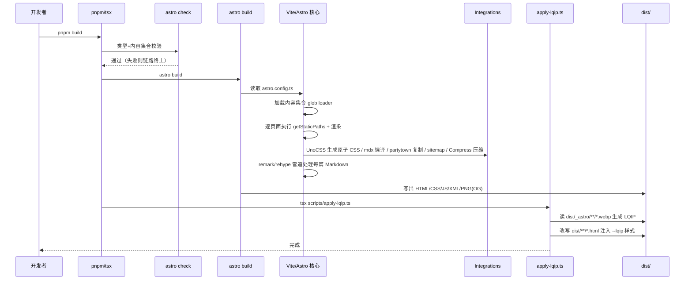

# 项目运行原理报告：astro-theme-retypeset

> 分析对象：`D:\Guiyuan1111\guiyuan1111.cn`
> 前置阅读：[01-architecture.md](./01-architecture.md)（架构分层与调用链）
> 本报告回答：站点从一条命令到一份 HTML 产物之间到底发生了什么。
>
> ⚠️ **本报告已部分过时（当前 v1.0.8）**：详见 [总览的变更对照表](./index.md)。主要失效点：
> 第 1.1/1.2 节的**三段式构建链**（`astro check` 已拆为独立 `pnpm check`、`astro-compress` 已移除）；
> 第 2 节与第 4 节中所有 `src/pages/[...lang]/...` 路径（**目录已改名**）；
> 第 7 节 i18n 机制（多语言已永久停用）。
> **仍然准确**：Markdown→HTML 变换流水线 21 步、LQIP 位打包与增量缓存、OG 生成、状态持久化、
> 错误处理分层、Partytown 隔离。

---

## 1. 启动/构建流程总览

### 1.1 命令到产物的完整序列

`package.json:7-18` 定义了全部命令。

> **〔2026-09-27 后续更正〕** 分析时核心构建链为三段式，**v1.0.2 起已改为两段式**，
> 类型检查独立为 `pnpm check`（v1.0.3 起由 CI 执行）：
>
> ```bash
> pnpm build  ==  astro build  &&  pnpm apply-lqip
> pnpm check  ==  astro check        # 独立门禁，不在 build 链内
> ```
>
> 下方时序图与 1.2 节「阶段 1：`astro check`」按原三段式绘制，**阶段 1 现不随 `pnpm build` 执行**；
> `astro-compress` 也已于 v1.0.2 移除，1.2 节收尾描述中的 Compress 步骤已不存在。



### 1.2 各阶段详解

**阶段 1：`astro check`**〔已更正〕。使用 `@astrojs/check`（`package.json:49`）对 `.astro` 组件与内容集合 schema 做静态诊断。任何 zod schema 校验错误（如 `published` 缺失）在此暴露。
**v1.0.2 起它已不在 `pnpm build` 链内**，改为独立命令 `pnpm check`，由 CI 在 build 之前执行（v1.0.3）——本地直接 `pnpm build` 不再有这道前置闸门。

**阶段 2：`astro build`**（默认 SSG 输出到 `dist/`；原「阶段 2」现为 `pnpm build` 的第一段）：

1. 加载 `astro.config.ts` 的 integration（UnoCSS、mdx、partytown、sitemap，共 4 个 —— `astro-compress` 已于 v1.0.2 移除）；
2. 内容层扫描：`src/content.config.ts:7` 的 `glob({ pattern: '**/*.{md,mdx}', base: './src/content/posts' })` 建立 posts 集合，about 集合同理；
3. 对每个动态路由执行 `getStaticPaths` 展开全部页面（文章页还会执行 slug 查重 fail-fast，`src/pages/posts/[slug].astro` —— 路由目录原为 `[...lang]/`，v1.0.7 已改名）；
4. 每个页面渲染时按第 2 节的数据流走 markdown 管道；
5. `astro-og-canvas` 在 `src/pages/og/[...image].ts:22` 为每篇文章渲染 PNG（canvaskit-wasm 绘制）；
6. 收尾：`sitemap()` 写 sitemap-index.xml。**原 `Compress` 压缩步骤已不存在**——HTML 由 Astro 的 `compressHTML` 默认压缩、JS/CSS 由 Vite 的 esbuild 默认压缩。

**阶段 3：`apply-lqip`**：详见第 3 节。

### 1.3 dev 模式差异

`pnpm dev` = `astro check && astro dev`（`package.json:8`）。dev 与 build 的行为差异仅两处，均为显式编码：

- 草稿可见性：`import.meta.env.DEV || !data.draft`（`src/utils/content.ts:85`、`[slug].astro:58`）——dev 下可见 draft，生产剔除；
- dev 不跑 Compress 与 apply-lqip（后两者只在 build 链中）。

---

## 2. 核心数据流一：一篇 Markdown 的完整生命

以 `src/content/posts/examples/故乡-zh.md` 为例，从文件到 HTML 的变量级变换：

### 2.1 变换流水线

| 步骤 | 输入 | 变换 | 输出 | 代码位置 |
| --- | --- | --- | --- | --- |
| 1. 发现 | 文件系统 `examples/故乡-zh.md` | glob loader 读取 + 解析 frontmatter | `CollectionEntry<'posts'>`（id、body、data） | `src/content.config.ts:7` |
| 2. 校验 | 原始 data | zod schema 解析（published 转 Date、默认值填充） | 类型安全的 `post.data` | `src/content.config.ts:8-28` |
| 3. 路由展开 | posts 数组 | filter（语言/草稿）→ map（slug、props） | `{params:{lang,slug}, props:{post,supportedLangs}}` | `[slug].astro:56-68` |
| 4. 阅读时长 | mdast tree | `toString(tree)` → reading-time → 取整下限 1 | `frontmatter.minutes: number` | `remark-reading-time.mjs:6-9` |
| 5. 容器指令 | mdast containerDirective 节点 | `:::note` → blockquote.admonition-note + title span；`:::fold[标题]` → details+summary；`:::gallery` → div.gallery-container | 带hName/hProperties 的 mdast | `remark-container-directives.mjs:65-109` |
| 6. GitHub admonition | blockquote 首行 `> [!NOTE]` | 正则剥离标记 → 同 createAdmonition | 同上 | `remark-container-directives.mjs:112-133` |
| 7. 叶子指令 | mdast leafDirective 节点 | `::github{repo="o/r"}` → 节点整体替换为 `type:'html'` 字符串 | html 节点 | `remark-leaf-directives.mjs:165-183` |
| 8. 数学 | mdast math 节点 | remarkMath 识别 `$...$`（标记给 rehypeKatex） | math 节点 | `astro.config.ts:66` |
| 9. mdast→hast | mdast tree | unified 内建转换 | hast tree | Astro 内部 |
| 10. KaTeX | hast 中 math 标记 | rehypeKatex 渲染为 HTML+CSS | 公式 markup | `astro.config.ts:72` |
| 11. Mermaid | pre 代码块 language-mermaid | rehype-mermaid（pre-mermaid 策略：保留原始文本，浏览器端渲染） | 带 mermaid 标记的 pre | `astro.config.ts:73` |
| 12. 标题 slug | h1-h4 | rehypeSlug 注入 id | 带 id 的标题 | `astro.config.ts:74` |
| 13. 锚点链接 | 带 id 的 h1-h4 | 追加 `<a.heading-anchor-link><svg>` 子节点 | 可点击标题 | `rehype-heading-anchor.mjs:6-51` |
| 14. 图片整流 | 仅含 img 的 `<p>` | 单图→figure(+figcaption，alt 以 `_` 开头则跳过)；多图非画廊→拆开；画廊内→figure.gallery-item | figure 结构 | `rehype-image-processor.mjs:31-75` |
| 15. 外链强化 | `<a href="http...">` | target=_blank + rel=noopener,noreferrer + data-umami-event | 安全外链 | `rehype-external-links.mjs:6-14` |
| 16. 复制按钮 | `pre>code` | pre 包进 div.code-block-wrapper 并前置 button | 包装块 | `rehype-code-copy-button.mjs:49-79` |
| 17. 语法高亮 | code 文本 | Shiki github-light/github-dark 双主题（排除 mermaid） | 带 CSS 变量的 span 树 | `astro.config.ts:80-90` |
| 18. 组件消费 | `{Content, headings, remarkPluginFrontmatter}` | render(post) 返回值解构 | 页面骨架填充 | `[slug].astro:80` |
| 19. HTML 写盘 | 组件树 | 序列化 | `dist/posts/<slug>/index.html`（v1.0.7 起无语言前缀段） | Astro SSG |
| 20. 压缩〔已更正〕 | HTML/CSS/JS | **不再有独立压缩步骤**：HTML 由 Astro 的 `compressHTML` 在写盘时默认压缩，JS/CSS 由 Vite 的 esbuild 默认压缩 | 减产物 | v1.0.2 移除 `astro-compress` |
| 21. LQIP 注入 | img[src] 命中映射表 | style 追加 `--lqip:#hex` | 带占位渐变的最终 HTML | `scripts/apply-lqip.ts:197-231` |

### 2.2 语言变体的并行流〔已作废〕

> **〔2026-09-27 后续更正〕** 多语言已永久停用，本小节描述的机制已全部移除：
> 同 slug 多语言文件已归档至 `i18n-backup/`；`slugToLangsMap` 与 `supportedLangs` 传递链已删除；
> `[...lang]` 路由目录已改名。当前同一篇《故乡》只有一个 `*-zh.md`，`posts/[slug].astro` 的
> `getStaticPaths` 直接按 `defaultLocale` 单层筛选，不再有任何语言聚合。
> 详见 [note/disabled-features.md](../../disabled-features.md) 第 1 节。

（原文存档：同一篇《故乡》存在 6 个语言文件（`-en/-es/-ja/-ru/-zh-tw/-zh`），各自独立走完上述管道。
`[slug].astro:28-54` 在 getStaticPaths 阶段用 `slugToLangsMap` 把同 slug 的所有语言版本聚合为一个语言集合
（universal 文章展开为 `allLocales` 全集），供页面上的语言切换按钮循环跳转
（经 `supportedLangs` prop 传给 `Layout` → `Button` 组件）。）

---

## 3. 核心数据流二：LQIP 图片占位

### 3.1 协议设计（编码端 JS / 解码端 CSS）

LQIP（Low-Quality Image Placeholder）这里不是常规的 base64 缩略图，而是**把 3 个采样像素的颜色位打包进一个 8 位 hex 字符串，再用纯 CSS 解包绘制三色径向渐变**。

编码端（`scripts/apply-lqip.ts`）：

```text
sharp 读取 webp
  → resize(3,3, fit:'fill') + removeAlpha + raw   :55-59
  → 27 字节 buffer，取 3 像素：
      index 0（左上 c0）、index 4（中心 c1）、index 8（右下 c2）  :70-72
  → c0: packColor11Bit = (R4b << 7) | (G4b << 3) | B3b          :35-40
      c1: packColor11Bit 同上                                    :75
      c2: packColor10Bit = (R3b << 7) | (G4b << 3) | B3b         :43-48
  → combined = (c0 << 21) | (c1 << 10) | c2    （11+11+10 = 32bit）:80
  → toString(16).padStart(8,'0')               即 8 位 hex       :83
  → map[webUrl] = hex 写入 src/assets/lqip-map.json              :167
```

解码端（`src/styles/lqip.css`）：选择器 `[style*="--lqip:"]`（`lqip.css:7`）捕获内联样式，用 CSS `color()` 函数对 hex 各通道做位运算还原出 `--lqip-c0/c1/c2` 三色（`lqip.css:12-46`），最后叠两层 radial-gradient + 底色（`lqip.css:48-72`）。编码的位布局（11/11/10）与解码的移位/取模互为镜像——这是本项目最精巧的跨语言（JS/CSS）契约。

### 3.2 增量缓存机制

`src/assets/lqip-map.json` 是**入库的持久化缓存**（当前 16 条记录）。运行决策树：

```text
scanAndAnalyzeImages()  统计 {total, cached, new}          apply-lqip.ts:105-130
│
├─ total === 0 → "无图片" 早退                            :242-245
├─ cleanLqipMap：从旧 map 剔除已消失的 URL                 :132-139（防 map 无限膨胀）
├─ new > 0  → processNewImages                            :252-253
│     仅处理 cleanedMap 中不存在的条目（增量）              :157
│     并发批处理，limit=10                                 :144,159-162
│     单图失败 console.error + 返回 null（跳过不中断）      :85-88
├─ new === 0 且发生过清理 → 仅回写瘦身后的 map              :256-260
└─ applyLqipToHtml：逐 HTML 文件注入，已含 --lqip 的跳过    :184-187（幂等）
```

幂等性由两处保证：生成侧查缓存（`:157`）、应用侧查 `currentStyle.includes('--lqip:')`（`:185-187`）。因此重复执行 `pnpm apply-lqip` 无副作用，失败重跑安全。

---

## 4. 核心数据流三：OG 社交卡片图

`src/pages/og/[...image].ts` 是构建期端点：

1. 顶层 `await getCollection('posts')`（`:7`）+ `getPostDescription(post, 'og')`（og 场景限长：CJK 70 字/其他 140 字，`src/utils/description.ts:18-21`）；
2. `OGImageRoute({ param:'image', pages })`（`:22-55`）为每个 post.id 生成 `/og/<id>.png`；
3. 绘制参数：Noto Sans SC 字体（`public/fonts/NotoSansSC-*.otf`）、logo `public/icons/og-logo.png`、边框色 `[242,241,245]`、单色背景渐变（`:28-53`）；
4. 消费端：文章页 `Head.astro:37-38` 把 og:image 指向 `new URL(`${base}/og/${postSlug}.png`)`；非文章页退化为 apiflash 截图服务（`:39-41`，注意 `Head.astro:41` 硬编码了一个公共 apiflash access key 作为主题默认值，属于上游主题自带的演示配置）。

---

## 5. 状态与持久化模型

静态站点无运行时状态，持久化分四处：

| 数据 | 位置 | 写入者 | 读取者 | 特征 |
| --- | --- | --- | --- | --- |
| 内容与元数据 | `src/content/posts/*.md` frontmatter | 作者/脚本 | 内容层 glob loader | 唯一"数据库" |
| LQIP 映射 | `src/assets/lqip-map.json` | apply-lqip.ts:167 | apply-lqip.ts:97 | 16 条缓存，构建间复用，可入库 |
| 浏览器端主题偏好 | `localStorage['theme']` | Head.astro:110 内联脚本 | isCurrentDark() | 优先级：localStorage > 配置默认 > 系统 |
| GitHub 卡片数据 | `sessionStorage['github-repo-<repo>']` | GithubCard.astro:49 | fetchRepoData() | 会话级缓存，失败静默清除重建（:23-28） |

构建产物 `dist/` 是最终持久化形态：HTML + `_astro/` 资产 + `og/*.png` + `rss.xml/atom.xml/sitemap-index.xml/robots.txt`，直接部署到任意静态托管。

---

## 6. 错误处理策略

分四层，策略不一：

1. **构建期 fail-fast**：slug 重复直接 `throw` 中断构建（`[slug].astro:21-23`）；`astro check` 失败短路整个 build 链（`package.json:9` 的 `&&` 语义）。zod schema 违规同样致命。
2. **构建期容错降级**：LQIP 单图处理失败仅 `console.error` 返回 null 跳过（`apply-lqip.ts:85-88`）；单 HTML 文件失败 warn 后 continue（`:224-227`）；指令参数缺失 `console.warn` 后保留原节点不转换（`remark-container-directives.mjs:91-92`、`remark-leaf-directives.mjs:8-10`）——错误内容不影响其他内容发布。
3. **运行时（浏览器）容错**：GitHub API 失败返回 null 并显示 "Failed to load data"（`GithubCard.astro:55-58,70-73`）；sessionStorage 读写全部 try/catch 包裹（`:17-28,48-51`）；sessionStorage 坏数据主动 removeItem 自愈（`:23-28`）。
4. **脚本级退出码**：new-post/format-posts/update-theme 失败 `process.exit(1)`（`new-post.ts:22,51`、`format-posts.ts:102-105`、`update-theme.ts:44`），供 CI/命令链感知。

---

## 7. i18n 运行机制〔已作废〕

> **〔2026-09-27 后续更正〕本节 7.1–7.4 描述的机制已随多语言永久停用而移除，仅作历史存档：**
>
> - **7.1** 启用子集现为 `moreLocales: []`（只有 `zh`），`src/i18n/lang.ts` 的 `getLangRouteParam`、
>   `getLangFromLocale` 已注释；`[...lang]` 路由目录已改名为普通路径，**语言前缀 URL 不再生成**。
> - **7.2** 页面与内容的语言匹配现恒为 `post.data.lang === 'zh' || post.data.lang === ''`，
>   `currentLang` 直接取 `defaultLocale`，不再经 `Astro.currentLocale` 换算。
> - **7.3** 语言切换按钮、`getNextSupportedLangPath` 及 `supportedLangs` 传递链已全部注释/删除。
> - **7.4** 评论系统已永久停用，三套 locale map 与评论组件一并注释/归档。
>
> `astro.config.ts` 的 `i18n` 块**仍保留**（`<html lang>` 与 `uno.config` 的 `cjk:` 变体依赖它）。
> 完整停用清单与恢复方法见 [note/disabled-features.md](../../disabled-features.md)。

### 7.1 语言注册与路由生成

- 语言全集：`langMap` 11 种（`src/i18n/config.ts:2-14`），短码→BCP-47 完整码；
- 启用子集：`locale: 'zh'` + `moreLocales: ['en','es','ja','ru','zh-tw']`（`src/config.ts:61-64`），共 6 种；
- Astro i18n 配置把 langMap 转成 `{path, codes}`（`astro.config.ts:37-43`），`Astro.currentLocale` 由此可用；
- 路由约定：默认语言 zh 无前缀（`getLangRouteParam('zh') === undefined`，`src/i18n/lang.ts:11-13`），其余 `/en/`、`/ja/`……

### 7.2 页面 × 内容的语言匹配矩阵

```text
页面 getStaticPaths:  allLocales（6 语言）逐一生成
内容过滤条件:          post.data.lang === currentLang || post.data.lang === ''（universal）
                                                    ↑ [slug].astro:60、content.ts:86
UI 文案:              ui[currentLang]（src/i18n/ui.ts:13-113，6 语言均有 title/subtitle/description/posts/tags/about/toc）
lang 属性:            <html lang={Astro.currentLocale}>（Layout.astro:39）
```

### 7.3 语言切换的三级回退

`getNextSupportedLangPath(currentPath, supportedLangs)`（`src/i18n/path.ts:93-112`）：

1. `supportedLangs` 为空 → 全局语言环（所有启用语言循环）；
2. 非空 → 按全局优先级（`allLocales` 索引序，`:99-104`）排序后，从当前语言在环中的下一个语言切换；
3. 路径改写：剥离 base → 剥离旧语言前缀（`:63-69`）→ `getLocalizedPath` 加新前缀并补回 base（`:42-52`）。

文章页的 `supportedLangs` 来自 slugToLangsMap（同 slug 的语言版本集合），标签页来自 `getTagSupportedLangs`（该标签在各语言下是否有文章，`src/utils/content.ts:223-238`）——保证"切过去必有内容"。

### 7.4 评论系统 i18n〔已作废〕

**评论系统已于 v1.0.8 永久停用**，组件与样式归档至 `comment-backup/`，三套 locale map 已整块注释，依赖已移除。

（原文存档：三套评论系统各有语言映射表并带降级：giscus 一一对应；twikoo 不支持的语言回退 en；waline 同样带 en-US 回退。）

---

## 8. Astro 生命周期介入点

本项目无 Astro middleware、无 on-demand 渲染，介入点全部在构建期：

| 生命周期阶段 | 项目内的介入 |
| --- | --- |
| 配置加载 | `astro.config.ts` 顶层读取 `src/config.ts`（`:12-13`） |
| 内容加载 | `content.config.ts` glob loader；`og/[...image].ts:7` 顶层 await 提前取集合 |
| 页面展开 | 每个动态路由的 `getStaticPaths`（含 slug 查重副作用） |
| Markdown 编译 | remark 链（5 插件）→ rehype 链（7 插件），顺序见 `astro.config.ts:64-79` |
| 组件 frontmatter（SSR 时） | `render(post)` 触发管道、`getPageInfo` 解析路径、memoize 缓存生效 |
| 视图转换 | `ClientRouter`（`Head.astro:94`）+ `astro:page-load` / `astro:before-swap` 事件：主题重初始化（`Head.astro:146-149`）、GitHub 卡片重挂载（`GithubCard.astro:109`）、TOC/复制按钮等 Widgets 同模式 |
| 构建收尾 | integrations 的收尾钩子（sitemap、Compress）+ 外部脚本 apply-lqip |

客户端交互组件（Widgets）统一采用"服务端输出静态结构 + `<script>` 监听 `astro:page-load` 重新初始化"的模式，以兼容视图转换后的 DOM 替换（证据：`GithubCard.astro:98-109`；`Layout.astro:59-64` 全局挂载 5 个 Widgets 脚本）。

---

## 9. 第三方脚本隔离：Partytown

统计脚本（GA gtag / Umami）以 `type="text/partytown"` 内联（`Head.astro:160-202`），由 Partytown 在 Web Worker 中执行，主线程仅转发 `dataLayer.push` 与 `gtag` 调用（`astro.config.ts:49-53`）。`Head.astro:158-159` 注释解释了一个关键细节：必须先在 window 上定义 `window.gtag` 才能让 Partytown 正确代理（上游 issue #382）。`patches/@qwik.dev__partytown@0.11.2.patch` 将新浏览器 API（`sharedStorage`、`AttributionReporting` 系列）加入 `isValidMemberName` 黑名单，避免 Worker 代理触发弃用 API 报错——这是 pnpm `patchedDependencies`（`package.json:69-72`）机制的实例。

---

## 10. 小结

运行原理可归纳为"一进三出"：Markdown 进，HTML/RSS/OG 图出，LQIP 与压缩做最后打磨。三大精巧机制值得注意：位打包 LQIP 的 JS/CSS 镜像协议（`apply-lqip.ts:35-83` ↔ `lqip.css`）、universal 内容（`lang:''`）驱动的一对多 i18n 路由展开（`[slug].astro:28-54`）、以及 memoize 化的构建期查询缓存（`src/utils/cache.ts:7-32`）。错误处理呈"构建期严格、内容级宽容、浏览器端自愈"的分层策略。
