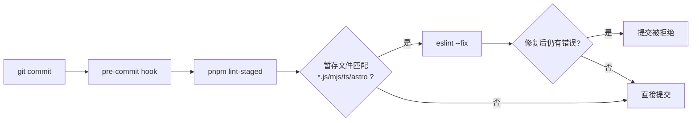
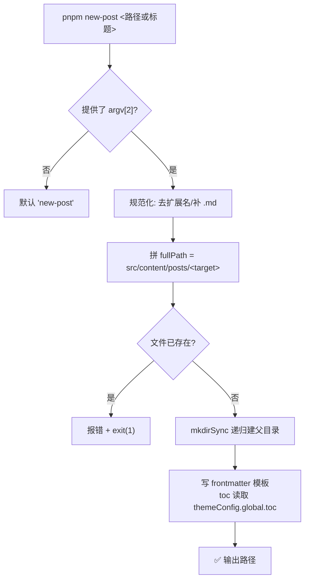
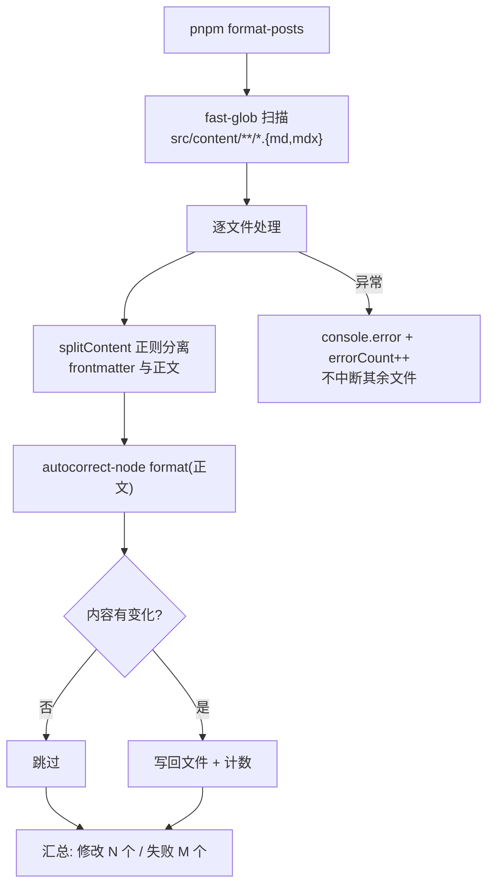
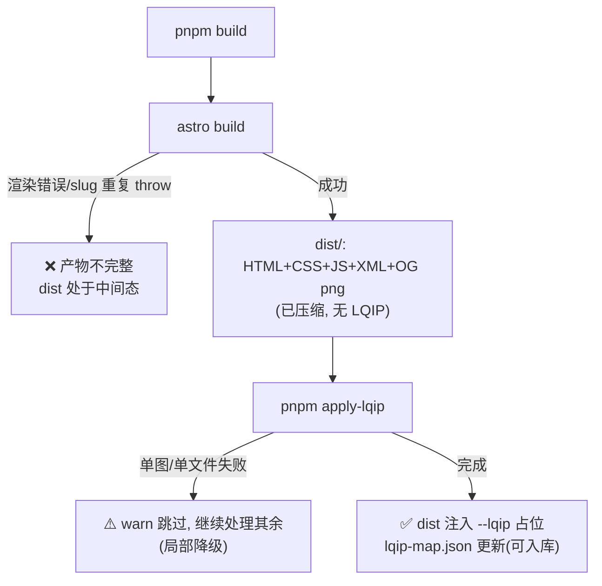

# 项目工作流报告：astro-theme-retypeset

> 分析对象：`D:\Guiyuan1111\guiyuan1111.cn`
> 前置阅读：[01-architecture.md](./01-architecture.md)、[02-operation-principles.md](./02-operation-principles.md)
> 本报告回答：围绕这个站点，开发者/作者实际执行哪些流程，每步发生什么，失败怎么办。
>
> ⚠️ **本报告是全文中过时最严重的一份（当前 v1.0.8）**，详见 [总览的变更对照表](./index.md)。
> **1.1 节的命令语义表、1.3 节、第 3 节构建失败语义、第 7 节小结均已就地更正**（见各处「后续更正」标注）；
> 第 4 节主题更新与第 5 节补丁管理仍然有效；第 2 节内容工作流（`new-post`/`format-posts`）仍然有效，
> 但外语文章已不在 `src/content/` 下，`format-posts` 的 glob 不再覆盖它们（现位于 `i18n-backup/`，见 [note/disabled-features.md](../../disabled-features.md)）。

---

## 1. 开发工作流（dev → lint → build → preview）

### 1.1 命令语义表〔已按 v1.0.8 更新〕

> **〔2026-09-27 后续更正〕** v1.0.2 把 `astro check` 从 `dev`/`build` 拆出为独立命令，并移除了
> `astro-compress`，原「三段式」已不成立。下表为当前 `package.json` 实际内容：

| 命令 | 实际执行 | 说明 |
| --- | --- | --- |
| `pnpm dev` | `astro dev` | 直接启动 dev server，不再串类型检查 |
| `pnpm build` | `astro build && pnpm apply-lqip` | 两段式：构建 + LQIP 注入（`:9`） |
| `pnpm check` | `astro check` | 类型与内容集合校验，**在 CI 中执行**（v1.0.3） |
| `pnpm preview` | `astro preview` | 预览 dist 产物（注意：看不到 apply-lqip 之外的差异） |
| `pnpm lint` / `lint:fix` | `eslint .` / `--fix` | antfu 预设，忽略 `src/content/**`、`note/**`、`i18n-backup/**`、`comment-backup/**` |
| `pnpm new-post <标题>` | `tsx scripts/new-post.ts` | 内容创作入口（`:14`） |
| `pnpm apply-lqip` | `tsx scripts/apply-lqip.ts` | 可单独执行（幂等，见 02 报告第 3 节） |
| `pnpm format-posts` | `tsx scripts/format-posts.ts` | CJK 排版整理 |
| `pnpm update-theme` | `tsx scripts/update-theme.ts` | 上游主题同步（依赖 git，现已可用） |

### 1.2 pre-commit 流程（simple-git-hooks + lint-staged）

`package.json:79-84`：

```json
"simple-git-hooks": { "pre-commit": "pnpm lint-staged" },
"lint-staged": { "*.{js,mjs,ts,astro}": "eslint --fix" }
```



注意：Markdown 内容文件不在 lint-staged 匹配内（内容质量靠 `format-posts` 手动触发，`eslint.config.mjs:6` 也显式忽略 `src/content/**`）。`onlyBuiltDependencies` 含 `simple-git-hooks`（`package.json:73-77`），保证 pnpm 安装时自动激活 hook。

### 1.3 本项目的特殊性：〔已修正〕版本控制与 CI 现已具备

> **〔2026-09-27 后续更正〕** 本节分析时项目无 `.git`、无 CI，**这两处缺口已于 v1.0.3 补齐**：
>
> - **版本控制**：已 `git init` 并推送到 `github.com/Guiyuan1111/guiyuan1111.cn`，主分支 `main`；
>   `update-theme.ts` 依赖的 upstream 同步、格式化回滚、细粒度提交均可用。
> - **CI/CD**：`.github/workflows/ci.yml` 双 job（`lint + typecheck` / `build`），push 与 PR 触发，
>   build job 缓存 astro-og-canvas 产物与 Astro 内容层（v1.0.4）。
> - **构建命令**：三段式已变为 `astro build && pnpm apply-lqip`，类型检查独立为 `pnpm check`（v1.0.2），
>   详见下方 1.1 节的更正说明。
> - **版本发布**：每版 tag + GitHub Release，正文即 `note/release/<版本>.md`，当前 **v1.0.8**。

---

## 2. 内容工作流

### 2.1 创建文章（new-post.ts）



生成的 frontmatter 模板（`scripts/new-post.ts:29-42`）完整覆盖 schema 全部 10 个字段：`title`（取 basename）、`published`（当前 ISO 时间）、`description: ''`、`updated: ''`、`tags: [Tag]`、`draft: false`、`pin: 0`、`toc: <themeConfig.global.toc>`、`lang: ''`、`abbrlink: ''`。支持子目录：`pnpm new-post guides/我的文章`（`join('src/content/posts', target)`，`:17`）。

### 2.2 文章 frontmatter 规范（作者视角速查）

| 字段 | 示例 | 效果 |
| --- | --- | --- |
| `title` | `故乡` | 必填；页面标题与 OG 图文字 |
| `published` | `2024-01-01` | 必填；排序键（降序） |
| `description` | `一句话简介` | 留空则自动从正文提取摘要（`src/utils/description.ts:82-93`） |
| `updated` | `2024-06-01` | 显示"更新于"；`''` 视为未设置（`content.config.ts:14-17`） |
| `tags` | `[散文, 鲁迅]` | 标签墙聚合 + 标签页 |
| `draft` | `true` | 生产构建隐藏，dev 可见 |
| `pin` | `10` | 0-99，首页置顶区降序 |
| `toc` | `false` | 覆盖全局目录开关 |
| `lang` | `en` | 留空 = universal 全语言可见 |
| `abbrlink` | `hometown` | 自定义 URL slug；留空用文件 id |

### 2.3 多语言内容流程

同一主题多语言 = 同目录同名文件加 `-<lang>` 后缀（如 `故乡-zh.md` 与 `故乡-en.md`，`src/content/posts/examples/` 下 4 组 × 6 语言）。各文件独立 frontmatter、独立发布节奏；`[slug].astro:28-54` 在构建期自动聚合同 slug 语言集合供语言切换。流程上没有中心化的翻译管理——多语言同步完全靠作者自律，这是 AI 化改造的高价值切入点（见 04 报告）。

### 2.4 格式化（format-posts.ts）



关键决策点：`splitContent` 的正则 `/^---\r?\n([\s\S]+?)\r?\n---\r?\n([\s\S]*)$/m`（`scripts/format-posts.ts:20`）只对正文做 autocorrect，frontmatter 原样保留——避免破坏 YAML。autocorrect 修正中英文之间的空格与标点（如 `中文english` → `中文 english`），与主题的排版美学定位一致。单文件失败不中断（`:93-96`），最终 `formatMarkdownFiles().catch` 兜底 exit(1)（`:102-105`）。

### 2.5 LQIP 补充流程（内容侧）

作者在文中引用图片：本地图放 `src/content/posts/_images/`（如 `1-light.jpeg`），Astro 构建期自动压缩为 `dist/_astro/*.webp`；`pnpm build` 第三段自动为它们生成占位色。无手动步骤——这是"零操作"的内容工作流设计。

---

## 3. 构建产物工作流（两段式的失败语义）

> **〔2026-09-27 后续更正〕** v1.0.2 起 `astro check` 已从 `pnpm build` 链中拆出（改由 `pnpm check` 与 CI 承担），
> 原「三段式」变为下图的**两段式**。原「check 短路 build」这层门禁现在由 CI 提供（v1.0.3）——
> 注意本地直接 `pnpm build` 时**不再有类型检查前置**。



失败语义不对称仍是本设计的关键：build fail-fast 保证产物可信；apply-lqip 宽容降级保证"占位样式缺失不阻塞发布"。类型与 schema 错误现由 `pnpm check` 和 CI 在 build 之前拦截。`dist/` 中间态风险：若 build 成功而 apply-lqip 失败（exit 1，`apply-lqip.ts:273-276`），发布脚本若只看整体退出码会放弃一个本可用的产物——决策点在于部署侧如何消费退出码。

---

## 4. 主题更新工作流（update-theme.ts）

脚本机制（`scripts/update-theme.ts:12-46`，46 行顶层顺序执行）：

1. 探测 `git remote get-url upstream`，失败则添加 `https://github.com/radishzzz/astro-theme-retypeset.git` 为 upstream（`:13-17`）；
2. `git fetch upstream` → 记录当前 HEAD → `git merge upstream/master --allow-unrelated-histories` → 再取 HEAD（`:21-25`）；
3. 两次 HEAD 相同 → "Already up to date"，不同 → "Updated successfully"（`:27-32`）；
4. 失败分支检查 `MERGE_HEAD` 文件是否存在：存在 = 冲突已暂存待手工解决，输出警告但不 exit(1)（`:34-45`）；不存在 = 真失败，exit(1)。

设计意图：主题是"模板仓库 fork 后个性化"的用法（README.md:42），`--allow-unrelated-histories` 让上游提交直接合入用户仓库。**当前本目录无 `.git`，该流程不可运行**；若要恢复，需先 `git init` 并做一次基线提交。

---

## 5. 依赖补丁管理流程

- 声明：`package.json:69-72` `pnpm.patchedDependencies` 指向 `patches/@qwik.dev__partytown@0.11.2.patch`；
- 内容：修改 Partytown 内联 snippet 与 4 个 bundle 的 `isValidMemberName`，把 `sharedStorage`/`AttributionReporting` 系列新 API 加入忽略名单（patch 文件 diff 可见）；
- 生效：pnpm install 时自动应用；`onlyBuiltDependencies`（`:73-77`）额外白名单了 esbuild/sharp/simple-git-hooks 的安装脚本；
- 维护：升级 `@qwik.dev/partytown` 版本号时 patch 会失配，需用 `pnpm patch` 重新生成——这是依赖升级工作流中的一个人工检查点。

---

## 6. 业务流程决策树与常量汇总

全项目工作流中出现的分支与魔法数字（便于后续调参/自动化）：

| 常量 | 值 | 位置 | 用途 |
| --- | --- | --- | --- |
| Feed 条数上限 | 25 | `src/utils/feed.ts:154` | RSS/Atom 截断 |
| 摘要限长 list/meta | CJK 120 / 其他 240 | `src/utils/description.ts:10-17` | 首页列表与文章 meta |
| 摘要限长 og/feed | CJK 70 / 其他 140 | 同上 | OG 图与订阅 |
| LQIP 并发上限 | 10 | `scripts/apply-lqip.ts:144` | sharp 批处理 |
| LQIP 进度输出间隔 | 每 10 张 | `scripts/apply-lqip.ts:152` | 日志节流 |
| pin 上限 | 99 | `src/content.config.ts:21` | 置顶权重范围 |
| 置顶判定 | `pin > 0` | `src/utils/content.ts:121` | 首页置顶区 |
| OG 图 logo 尺寸 | 250 | `src/pages/og/[...image].ts:30` | canvaskit 绘制 |
| OG 边框 | 色 `[242,241,245]` 宽 20 | `src/pages/og/[...image].ts:32-35` | 同上 |
| Spotify iframe 高度 | track 类 152 / 专辑类 352 | `src/plugins/remark-leaf-directives.mjs:146` | 嵌入布局 |
| prefetch 策略 | viewport 全站 | `astro.config.ts:32-35` | 性能调优入口 |

异常恢复路径汇总：

| 场景 | 恢复方式 | 证据 |
| --- | --- | --- |
| slug 重复导致构建失败 | 修改 `abbrlink` 或文件名后重跑 | `[slug].astro:20-23` |
| LQIP 单图失败 | 自动跳过；重跑 `pnpm apply-lqip` 补齐 | `apply-lqip.ts:85-88` |
| lqip-map.json 损坏 | 读取失败返回 `{}`，全量重建 | `apply-lqip.ts:100-102` |
| 主题更新冲突 | 手工解决后 `git commit`（脚本保留 MERGE_HEAD 状态） | `update-theme.ts:36-41` |
| 格式化误伤 | git 回滚（本目录暂无 git，需先初始化） | 2.4 节 |
| 评论数据 | 全部托管第三方（waline 自建服务器 `src/config.ts:105`），本地无恢复问题 | - |

---

## 7. 小结

本项目工作流的特点是"内容优先、零 ceremony"：创作只需 `new-post` + 编辑 Markdown；质量保障只有 pre-commit 的 eslint（不含内容文件）与手动的 `format-posts`；发布是一条本地构建命令。

> **〔2026-09-27 后续更正〕** 原结论中的两处缺口**均已修复**：版本控制与 CI/CD 已具备（见 1.3 节更正），
> 构建命令也不再是三段式。当前发布流程为 `pnpm build` → `git commit` → `git push` → CI 门禁 → tag + GitHub Release，
> 版本履历见 [note/release/](../../release/)，功能停用与恢复见 [note/disabled-features.md](../../disabled-features.md)。
