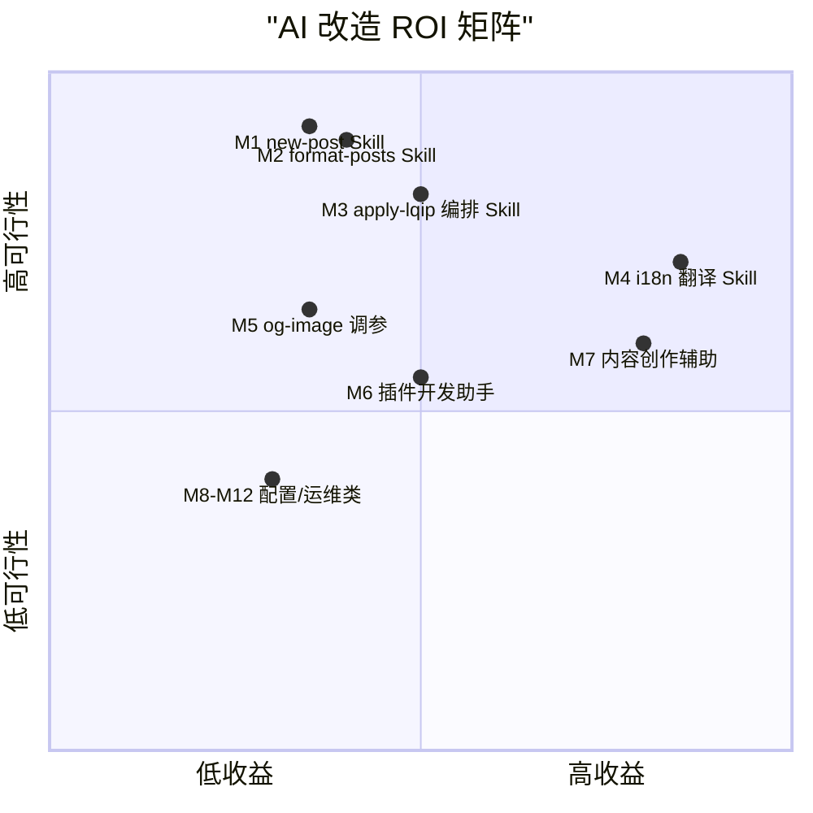

# AI 工作流替代方案报告：astro-theme-retypeset

> 分析对象：`D:\Guiyuan1111\guiyuan1111.cn`
> 前置阅读：[01-architecture.md](./01-architecture.md)、[02-operation-principles.md](./02-operation-principles.md)、[03-workflow.md](./03-workflow.md)
> 评分体系：确定性 / 输入结构化 / 安全风险（分越高越安全）/ 领域复杂度（分越高越简单）/ 上下文需求（分越高依赖越少）/ 重复性，各 1-5 分，满分 30。
> 分档：24-30 = 🤖 完全 AI 化；15-23 = 🧑‍💻 AI 辅助；6-14 = 👤 人工主导。
>
> ⚠️ **本报告与所属 Skill Blueprint 已部分过时（当前 v1.0.8）**：详见 [总览的变更对照表](./index.md)。
> **M4「i18n 内容翻译/多语言同步」与 [blueprints/04-i18n-translate-skill.md](./blueprints/04-i18n-translate-skill.md)
> 已整体作废** —— 多语言已永久停用，蓝图依赖的 `[...lang]` 路由与 `slugToLangsMap` 聚合机制均已移除。
> M8「评论/统计集成配置」中的评论部分同样作废（评论系统已永久停用，见 [note/disabled-features.md](../../disabled-features.md) 第 3 节）。
> M1/M2/M3/M5 仍可参考，但涉及文件行号需按当前代码核对。

---

## 1. 模块总评分表

| # | 模块 | 确定性 | 输入结构化 | 安全风险 | 领域复杂度 | 上下文需求 | 重复性 | 总分 | 分档 |
| --- | --- | --- | --- | --- | --- | --- | --- | --- | --- |
| M1 | new-post 文章创建 | 5 | 5 | 5 | 5 | 5 | 4 | 29 | 🤖 |
| M2 | format-posts 格式化 | 5 | 5 | 5 | 5 | 5 | 4 | 29 | 🤖 |
| M3 | apply-lqip 图片处理 | 5 | 4 | 5 | 3 | 4 | 4 | 25 | 🤖 |
| M4 | i18n 内容翻译/多语言同步 | 3 | 4 | 5 | 3 | 4 | 3 | 22 | 🧑‍💻 |
| M5 | og-image 生成调参 | 5 | 4 | 4 | 3 | 4 | 3 | 23 | 🧑‍💻 |
| M6 | remark/rehype 插件开发 | 3 | 3 | 4 | 2 | 2 | 3 | 17 | 🧑‍💻 |
| M7 | 内容创作（写文章本体） | 2 | 3 | 4 | 2 | 3 | 2 | 16 | 🧑‍💻 |
| M8 | 评论/统计集成配置 | 4 | 4 | 3 | 3 | 2 | 1 | 17 | 🧑‍💻（一次性） |
| M9 | 主题样式/布局定制 | 3 | 3 | 4 | 2 | 2 | 2 | 16 | 🧑‍💻 |
| M10 | 构建部署运维 | 4 | 3 | 2 | 3 | 2 | 3 | 17 | 🧑‍💻（外部依赖） |
| M11 | 主题上游同步 | 3 | 3 | 3 | 3 | 2 | 1 | 15 | 🧑‍💻 |
| M12 | SEO/站点配置决策 | 2 | 4 | 3 | 3 | 2 | 1 | 15 | 🧑‍💻 |

评分依据摘要：

- **M1/M2 确定性满分**：`new-post.ts`（52 行）与 `format-posts.ts`（105 行）是纯文件变换，输入输出均为 Markdown 文件，失败模式简单（`new-post.ts:20-23` 防覆盖、`format-posts.ts:55-57` 幂等跳过），AI 可端到端接管甚至增强。
- **M3 定 5 结 4**：`apply-lqip.ts` 逻辑确定但有 sharp 位运算细节（`:35-83`）；安全（只写 `dist/` 与 map 文件）。
- **M10 安全分最低**：部署涉及域名、托管平台凭据与生产产物，AI 不应自主操作。
- **M7 确定性最低**：创作质量与个人风格是主观领域。

---

## 2. 模块评估卡片

### 卡片 M1：new-post 文章创建器 🤖

| 维度 | 内容 |
| --- | --- |
| 当前状态 | 52 行 CLI 脚本，交互为零：无参数默认 'new-post'，不支持交互式补全 frontmatter（`scripts/new-post.ts:12-42`） |
| AI 替代方式 | Skill 化：对话式收集标题/标签/草稿意图 → 生成 frontmatter → 写文件 → 可选追加 format-posts 与多语言骨架 |
| 实施难度 | 低（复用现有脚本逻辑 + schema 约束即可） |
| 预期收益 | 中：省去手改模板；自动生成 description 初稿、按命名约定建多语言文件组 |
| 优先级 | P0 |
| 风险 | 低；唯一注意点是防覆盖（已有 `existsSync` 先例 `new-post.ts:20-23`，Skill 必须保留） |

### 卡片 M2：format-posts 格式化器 🤖

| 维度 | 内容 |
| --- | --- |
| 当前状态 | 105 行脚本，autocorrect 全量处理，无法只处理单文件（`scripts/format-posts.ts:39` 固定 glob 全目录） |
| AI 替代方式 | Skill 化：支持指定文件/目录参数、dry-run 预览 diff、按需调用 autocorrect 或让 AI 直接完成排版修正 |
| 实施难度 | 低 |
| 预期收益 | 中：发布前单篇整理频率远高于全站整理，参数化后实用度大增 |
| 优先级 | P0 |
| 风险 | 低；须保持"frontmatter 原样保留"契约（`format-posts.ts:20,47-52`） |

### 卡片 M3：apply-lqip 图片处理 🤖

| 维度 | 内容 |
| --- | --- |
| 当前状态 | 276 行，已具备缓存/增量/并发/幂等（`scripts/apply-lqip.ts:105-231`），自动化程度已很高 |
| AI 替代方式 | 不重写算法，Skill 化调度：build 后自动运行、失败诊断（解读 ⚠️ 日志、修复 map 损坏）、统计报告 |
| 实施难度 | 中低（编排为主，算法不动） |
| 预期收益 | 中：把三段 build 的人工监督环节交给 AI 巡检 |
| 优先级 | P1 |
| 风险 | 位打包协议（11/11/10 bit）不可改错，AI 只编排不碰算法即无风险 |

### 卡片 M4：i18n 内容翻译 🧑‍💻

| 维度 | 内容 |
| --- | --- |
| 当前状态 | 无任何工具支持：多语言靠手工复制文件改后缀（03 报告 2.3 节），语言集合由构建期自动聚合（`[slug].astro:28-54`） |
| AI 替代方式 | Skill：读源语言 md → 翻译正文（保留指令/代码块/LaTeX 不译）→ 写 `<标题>-<lang>.md` → 更新目标语言 frontmatter |
| 实施难度 | 中（需保护指令语法与术语表） |
| 预期收益 | 高：这是本项目内容工作流中人工成本最大、最适合 AI 的环节 |
| 优先级 | P0 |
| 风险 | 中：译文质量、`abbrlink` 必须与源文件一致（同 slug 聚合的前提，`[slug].astro:31`） |

### 卡片 M5：og-image 生成调参 🧑‍💻

| 维度 | 内容 |
| --- | --- |
| 当前状态 | 配置即产物：字体/边框/渐变集中在 `src/pages/og/[...image].ts:25-54`，构建期批量出图 |
| AI 替代方式 | AI 辅助调参 + 本地预览验证；可扩展模板（按 tag 定制配色） |
| 实施难度 | 中低 |
| 预期收益 | 中低 |
| 优先级 | P2 |
| 风险 | 低；注意 `Head.astro:41` 硬编码的 apiflash 公共 key 属上游演示配置，改造时应清理 |

### 卡片 M6：remark/rehype 插件开发 🧑‍💻

| 维度 | 内容 |
| --- | --- |
| 当前状态 | 7 个插件共约 662 行，模式统一（visit + handler 表），新增嵌入类型只需扩 `embedHandlers`（`remark-leaf-directives.mjs:3-161`） |
| AI 替代方式 | AI 按既有模式生成新插件（如 `::bilibili` 已有，可加 `::codepen` 变体、`::nicovideo`），AI 写单测验证 AST 变换 |
| 实施难度 | 中（AST 领域知识 + 对上游 unified 版本的兼容确认） |
| 预期收益 | 中 |
| 优先级 | P2 |
| 风险 | 中：插件顺序敏感（`astro.config.ts:64-79`），AI 改动需回归验证 |

### 卡片 M7：内容创作 🧑‍💻

| 维度 | 内容 |
| --- | --- |
| 当前状态 | 55 篇 md，含示例内容；写作本身是人的领域 |
| AI 替代方式 | AI 起草 + 人定稿；AI 遵守 schema（`content.config.ts:8-28`）与排版规范直接产出可构建文件 |
| 实施难度 | 低（工具就绪）/ 高（质量把关） |
| 预期收益 | 高（吞吐量） |
| 优先级 | P1 |
| 风险 | 中：内容同质化、事实错误；draft 流程（`content.config.ts:20`）可作为 AI 稿人工审核的闸门 |

### 卡片 M8-M12 摘要

- **M8 评论/统计集成**：改 `src/config.ts:79-157` 一次成型，重复性 1 分，AI 按文档填配置即可（17 分 🧑‍💻，一次性）；
- **M9 样式定制**：UnoCSS attributify + oklch 色板（`uno.config.ts:14-48`），AI 可提案但视觉决策归人（16 分 🧑‍💻）；
- **M10 构建部署**：安全风险 2 分（凭据/生产），AI 仅做诊断与日志解读，不自主部署（17 分 🧑‍💻）；
- **M11 上游同步**：`update-theme.ts` 依赖 git（当前缺失），冲突解决本质是语义合并，AI 可辅助但决策归人（15 分 🧑‍💻）；
- **M12 SEO 决策**：`src/config.ts:121-157` 结构化好，但验证码/分析 ID 是账号资产（15 分 🧑‍💻）。

---

## 3. 函数级下钻：完全 AI 化与高优先级 AI 辅助模块

### 3.1 M1 new-post.ts 函数清单

| 函数/逻辑块 | 签名 | 位置 | 行数 | AI 替代潜力 |
| --- | --- | --- | --- | --- |
| 路径解析（顶层） | `argv[2] -> fullPath: string` | `new-post.ts:12-17` | 6 | 高：可替换为参数校验更严的 Skill 输入解析 |
| 存在性检查（顶层） | `existsSync(fullPath) -> exit(1)` | `new-post.ts:20-23` | 4 | 保留原样（不变式：绝不覆盖） |
| 目录创建（顶层） | `mkdirSync(dirname, {recursive})` | `new-post.ts:26` | 1 | 保留原样 |
| 模板生成（顶层） | `(baseName, tocCfg) -> frontmatter: string` | `new-post.ts:29-42` | 14 | 高：AI 按语义生成 description/tags 初稿，字段全集与 schema 对齐 |
| 写盘（顶层） | `writeFileSync try/catch -> exit(1)` | `new-post.ts:45-52` | 8 | 保留原样 |

**接口契约（M1/M2 通用）**：
- 前置条件：cwd 为项目根；`src/content/posts/` 可写；
- 后置条件：新文件 frontmatter 满足 `content.config.ts:8-28` 全部约束（`published` 为合法日期、`abbrlink` 匹配 `^[a-z0-9\-]*$`、`pin` ∈ [0,99]）；
- 不变式：不覆盖已存在文件；不触碰他人文件；
- 错误场景：文件已存在（exit 1）、磁盘写入失败（exit 1）。

### 3.2 M2 format-posts.ts 函数清单

| 函数 | 签名 | 位置 | 行数 | AI 替代潜力 |
| --- | --- | --- | --- | --- |
| `splitContent` | `(content: string) -> MarkdownContent` | `format-posts.ts:19-34` | 16 | 保留：契约"frontmatter 不动"的实现核心 |
| `getMarkdownFiles` | `() -> Promise<string[]>` | `format-posts.ts:37-42` | 6 | 高：参数化（目录/单文件/glob） |
| `formatSingleFile` | `(filePath: string) -> Promise<boolean>` | `format-posts.ts:45-63` | 19 | 中：autocorrect 调用保留，外面包 dry-run/diff |
| `reportResults` | `(changedCount, errorCount) -> void` | `format-posts.ts:66-77` | 12 | 低（纯输出） |
| `formatMarkdownFiles` | `() -> Promise<void>` | `format-posts.ts:80-100` | 21 | 中：错误计数与继续语义保留 |

**接口契约**：前置：目标文件为 UTF-8 Markdown；后置：frontmatter 字节不变、正文仅空白/标点规范化；不变式：幂等（第二次运行 changed=0，`:55-57`）；错误场景：读文件失败计入 errorCount 不中断。

### 3.3 M3 apply-lqip.ts 函数清单

| 函数 | 签名 | 位置 | 行数 | AI 替代潜力 |
| --- | --- | --- | --- | --- |
| `packColor11Bit` | `(r,g,b: number) -> number` | `apply-lqip.ts:35-40` | 6 | 零（协议常量） |
| `packColor10Bit` | `(r,g,b: number) -> number` | `apply-lqip.ts:43-48` | 6 | 零 |
| `generateLqipValue` | `(imagePath: string) -> Promise<string \| null>` | `apply-lqip.ts:50-89` | 40 | 零（算法核心），AI 仅做失败日志解读 |
| `loadExistingLqipMap` | `() -> Promise<LqipMap>` | `apply-lqip.ts:95-103` | 9 | 零 |
| `scanAndAnalyzeImages` | `() -> Promise<{fileMappings, imageStats, existingMap}>` | `apply-lqip.ts:105-130` | 26 | 低 |
| `cleanLqipMap` | `(existingMap, fileMappings) -> LqipMap` | `apply-lqip.ts:132-139` | 9 | 低 |
| `processNewImages` | `(fileMappings, stats, cleanedMap) -> Promise<LqipMap>` | `apply-lqip.ts:141-171` | 31 | 低（并发编排已最优） |
| `processImage` | `(img: HTMLElement, lqipMap) -> boolean` | `apply-lqip.ts:173-195` | 23 | 零（幂等判定在此） |
| `applyLqipToHtml` | `(lqipMap) -> Promise<number>` | `apply-lqip.ts:197-231` | 35 | 低 |
| `main` | `() -> Promise<void>` | `apply-lqip.ts:237-271` | 35 | 中：AI Skill 负责调用时机、结果解读、失败重试决策 |

**接口契约**：前置：`dist/` 存在（build 之后运行）；后置：`src/assets/lqip-map.json` 与 dist HTML 一致、HTML 中每张命中图片 style 恰好含一个 `--lqip:`；不变式：重复运行零变化（幂等）；错误场景：单图失败跳过（不破坏 map）、单 HTML 失败跳过、全局异常 exit(1)（`:273-276`）。**AI 化边界：Skill 只拥有"何时调用 + 如何解读退出码/日志 + 是否重跑"的决策权，不修改位打包算法与 CSS 解包协议。**

### 3.4 M4 i18n 翻译（AI 辅助）函数级设计

该模块当前无代码，需新建 Skill，但可复用的既有契约：

| 既有资产 | 位置 | 在 Skill 中的作用 |
| --- | --- | --- |
| `langMap`/`allLocales` | `src/i18n/config.ts:2-14`、`src/config.ts:204-206` | 目标语言合法性校验（仅 11 种） |
| schema `lang` 字段 | `src/content.config.ts:23` | 生成文件必须写目标 lang 码 |
| slug 聚合逻辑 | `[slug].astro:28-54` | **硬约束：译文的 `abbrlink` 与文件名必须与源文件同 slug** |
| 命名约定 `<标题>-<lang>.md` | `src/content/posts/examples/` 实例 | 输出文件名规则 |
| `checkPostSlugDuplication` | `src/utils/content.ts:42-70` | 翻译后自检手段（同语言内不重复） |

**接口契约**：前置：源文件 frontmatter 完整；后置：新文件 `lang=<目标码>`、`abbrlink` 与源一致、正文指令/代码块/链接/`abbrlink` 不变；不变式：不修改源文件、不产出已存在语言副本；错误场景：目标语言已存在（拒绝）、语言码非法（拒绝）。

---

## 4. ROI 优先级矩阵

## 5. AI 改造路线图

**Phase 1（低风险高频次，1-2 周）**：落地 3 个完全 AI 化 Skill——new-post 增强版（含多语言骨架）、format-posts 参数化（含 dry-run）、apply-lqip 编排巡检。三者均不改动现有算法与 schema，只把 03 报告中的手动命令升级为对话式 Skill。

**Phase 2（高价值中风险，2-4 周）**：i18n 翻译 Skill（P0 收益最大项）+ 内容创作辅助流程（AI 起草 → `draft: true` → 人审 → 转 正式），并把"翻译后自检"（slug 一致性、schema 校验、`astro check`）固化为 Skill 的收尾步骤。

**Phase 3（能力扩展，按需）**：插件开发助手（照 `remark-leaf-directives.mjs` 的 handler 表模式扩充嵌入类型）、OG 图模板化、发布流水线 AI 巡检（构建日志解读、失败分类）。前置建议：先恢复 git 仓库与最小 CI（GitHub Actions 跑 `pnpm lint && pnpm build`），否则一切 AI 自动化改动缺少回滚与门禁——这是所有 Phase 的共同基础设施前提。

---

## 6. 小结

本项目约 5100 行源码中，**可直接完全 AI 化的是三个运维脚本（M1-M3，共约 433 行）的调度层**，而**收益最大的 AI 化对象不在代码而在内容工作流：多语言同步（M4）**。代码侧的架构（schema 驱动、指令扩展表、幂等脚本）对 AI 极其友好——约束都写在 `content.config.ts` 与脚本契约里，天然是 AI 可执行的规格说明。5 个 Blueprint（M1-M4 + 发布巡检）见 [blueprints/index.md](./blueprints/index.md)。
