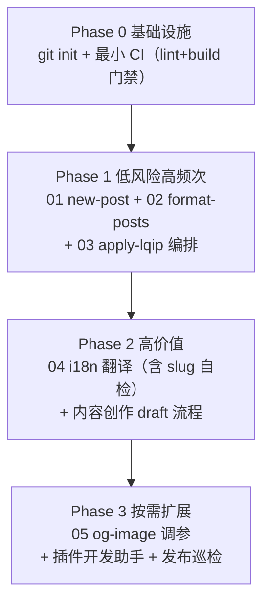

# Skill Blueprint 索引

> 隶属分析：[astro-theme-retypeset 深度分析总览](../index.md)
> 评级依据：[04-ai-substitution.md](../04-ai-substitution.md) 的 6 维度评分与 ROI 矩阵。
>
> ⚠️ **本索引已部分作废（当前 v1.0.8）**：详见 [总览的变更对照表](../index.md)。
>
> | Blueprint | 状态 |
> | --- | --- |
> | [01 new-post](./01-new-post-skill.md)、[02 format-posts](./02-format-posts-skill.md)、[03 apply-lqip](./03-apply-lqip-skill.md) | ✅ 仍可参考（脚本未变），行号需核对 |
> | [04 i18n-translate](./04-i18n-translate-skill.md) | ❌ **作废**：多语言已永久停用，路由与 `slugToLangsMap` 均已移除 |
> | [05 og-image-tuner](./05-og-image-tuner-skill.md) | ✅ 仍可参考，但 og 图静态化后（v1.0.3）调参需求已减弱 |
>
> 下方「实施路线图」中的 **Phase 0（git + CI）已于 v1.0.3 完成**，**Phase 2 的 i18n 翻译项已作废**。

## Blueprint 清单

| 编号 | Blueprint | 目标模块 | 评级 | 优先级 | 文件 |
| --- | --- | --- | --- | --- | --- |
| 01 | new-post-skill | `scripts/new-post.ts` | 🤖 完全 AI 化（29/30） | P0 | [01-new-post-skill.md](./01-new-post-skill.md) |
| 02 | format-posts-skill | `scripts/format-posts.ts` | 🤖 完全 AI 化（29/30） | P0 | [02-format-posts-skill.md](./02-format-posts-skill.md) |
| 03 | apply-lqip-skill | `scripts/apply-lqip.ts`（调度层） | 🤖 完全 AI 化（25/30） | P1 | [03-apply-lqip-skill.md](./03-apply-lqip-skill.md) |
| 04 | i18n-translate-skill | 多语言内容流程（当前无工具） | 🧑‍💻 AI 辅助（22/30，收益最高） | P0 | [04-i18n-translate-skill.md](./04-i18n-translate-skill.md) |
| 05 | og-image-tuner-skill | `src/pages/og/[...image].ts` | 🧑‍💻 AI 辅助（23/30） | P2 | [05-og-image-tuner-skill.md](./05-og-image-tuner-skill.md) |

## 实施路线图

- **Phase 0（共同前提）**：本目录当前无 `.git`、无 CI（详见 [../03-workflow.md](../03-workflow.md) 第 1.3 节）。任何 Skill 自动化改动都需要可回滚、有门禁的基础，否则收益不可持续。
- **Phase 1**：三个 🤖 Skill 均不触碰算法与 schema，只是把现有命令升级为对话式并增强参数化（dry-run、定向目录、结果解读）。
- **Phase 2**：04 翻译 Skill 是全项目收益最大项（当前多语言完全靠手工，`src/content/posts/examples/` 下 4 组 × 6 语言即为例证）；硬约束是 `abbrlink` 与文件 slug 必须与源一致（`src/pages/[...lang]/posts/[slug].astro:28-54` 聚合的前提）。
- **Phase 3**：05 为代表的能力扩展类，按需实施；另有插件开发助手（照 `src/plugins/remark-leaf-directives.mjs:3-161` 的 handler 表模式）与构建巡检，见 [../04-ai-substitution.md](../04-ai-substitution.md) 路线图第 3 阶段。

## 共通设计原则

1. **算法冻结**：所有 Skill 只拥有"调度 + 校验 + 报告"权，位打包协议（`scripts/apply-lqip.ts:35-83` ↔ `src/styles/lqip.css`）、AST 插件管道（`astro.config.ts:63-79`）不许 AI 改写。
2. **schema 即规格**：所有产出文件以 `src/content.config.ts:6-36` 为唯一验收标准，Skill 收尾步骤应包含 `astro check` 复核。
3. **幂等与不覆盖**：承袭脚本既有契约（`new-post.ts:20-23`、`apply-lqip.ts:157,185-187`、`format-posts.ts:55-57`），Skill 不得引入破坏幂等的写入路径。
4. **写权限最小化**：每个 Blueprint 的 allowed-tools 明确圈定可写目录，源码目录（`src/` 非内容部分、`scripts/`、`patches/`）默认只读。
