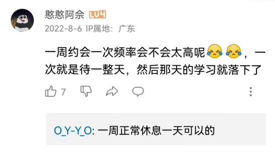

> 沉思往事立斜阳。当时只道是寻常。
>
> ——纳兰性德《浣溪沙·谁念西风独自凉》

> 右手敬礼，左手牵你。

> 开始学会用没心没肺，来掩饰我的撕心裂肺。

> "你还记得她吗？"
>
> "早忘了，哈哈"
>
> "我还没说是谁。"

> 5年前，我大她2岁，现在我大她7岁了。

> 第一次是在高中，你让我坐在琴室听你弹刚学会的曲子；第二次是高三的晚自习，一人一个耳机，你在纸上写着"试着和你在一起"；第三次是在大二，我牵着你的手走过小巷，这首钢琴曲在旁边的小店缓缓播放；第四次，我在北纬39°的北京刷着你的微博，看着你在南纬37°的墨尔本牵着另一个男生的手，笑靥如花。

> 我连一秒都没有拥有过她，却感觉失去过她千万次。

> 16年高考，我文科568，女朋友570，我们报了同样的志愿，可是分数线出来之后，第一个志愿分数线569，我被第二个志愿录取了，我们中间隔了300人。老师会说一分千人，可我要说，一分只会是150人、1900km、1000块的机票、3小时的飞行时间和一生的遗憾。

> 泰坦尼克号 Rose 说："我甚至连他的一张照片都没有，他只活在我的记忆里。"

> 我好想你，第一句是假的，第二句也是。

> 你难过什么？不是你亲手将我推开的吗？

> 合适就是两个人在一起很放的开，完全不会产生"我这样做对方会不会离开我"这样的想法，舍不得不过是占有欲作祟，就好像你丢了东西害怕被别人捡去一样，如果这个东西即使丢了也不担心没人会捡去，那你就不会舍不得。

> 我其实比你更早知道我们不合适，只是一直舍不得。

> 听故事的人总喜欢问"后来呢？"却不知，讲故事的人早已泪流满面。

> 今天的云很好看，我想拍下来发给你，却突然想到，我们好久不联系了。突然就觉得，其实云也没有那么好看。云还是那朵云，只是没了那个人。但是我还是把云拍了下来，万一有一天咱俩巧合之下有了联系，这样就有了"那天的云很美"的话题，这样你也就能知道那天的云很美，那天的我也很想你。之后我又偷偷地把照片删了，因为真正的美好不是那云，而是此刻我正思念的你。于是后来每次看到那样的云，我还是忍不住会拍下来，然后过一段时间又偷偷删掉。就像记忆一样，不断地记住，又不断地忘记，直到有一天不再记得我那天拍过照，也想过你。

> "不和睦的家庭，失败的教育，假惺惺的友情，不上进的成绩，不顺利的感情，刚好都被我碰到了。"

> 初中时，我喜欢了三年的男生，中考前一天晚上，他发消息告诉我："明天好好考，我在一中等你，晚安。"故事的最后，我没能考上一中，所以我们还是错过了。

> 夏天的遗憾就停留在夏天吧。

> 如果可以被保护，谁愿意风雨中流浪。

> 你说时间快不快，00后都可以谈论童年了...

> 早知道离开会这么痛苦，我宁愿从来没有遇见过。

> "后来初中的风也没吹到高中，我的爱也留在了那年夏天。"

> 那年风好大，吹散了好多人。

> 第一次见你是高一对面楼上，你坐在护栏上，一个人看着对面楼发呆，那一刻我就记住了你。后来是高二开学，惊讶地发现你是我的前桌，心中的喜悦无以言表。最后在高中毕业典礼上我鼓起勇气向你表白，你笑嘻嘻地跟我说，我高一课间就看到你喜欢在下课的时候在走廊上发呆啦。昨天我参加了你的婚礼，你依然很美。

> 当你又一次联系我，我终于不再兴奋紧张，我终于学会对你爱答不理，我终于不再像以前那么没出息，你勾勾小手就屁颠屁颠的跑过去。那种听见你的声音和见到你就想笑的感觉，一种我觉得会永远的感觉，竟然不见了。我明白，你终于从我心里搬出来了。可是，为什么还会想哭。

> 不得不承认我是个很天真的人，谈了恋爱就想过一辈子，交个朋友就想往来一生，尽管有时候故作姿态说着一切顺其自然，可心里不愿让任何美好的事情发生一丝的改变，对于一个在感情上没有远见的人来说，最大的期盼大概就是希望所有的感情都能真挚且长久了吧。

> 异地三年，今年寒假打电话跟我说，她受不了异地恋了。我以为是要跟我分手了。第二天看到她拖个行李箱，说以后再也不异地了。

> 我本江头摆渡翁，偏偏垂首独爱侬。

> "这样确切的爱，一生只有一次。"

> 他意外身亡，她伤心过后，决定走遍所有传闻闹鬼的地方。结果，跑了十几年都没有见到一只鬼，她很绝望，她说："我真的不可能再见到你了吗？还是你不想再见到我？"忽然身后响起一个幽幽的声音："你以为你都是怎么从那些地方平安走出来的。"

> 2012年，那年大一，军训，我们相识。异乡的冬天冻伤了她的初恋，我却没有理由给她一个安慰的拥抱。此后的日子我们依然是朋友，偶尔碰面寒暄，而后走散在汹涌的人潮。她又有了一个他，继而凋谢。2015年，大三。我们一起散步，夜色的掩护下我向她表白了，她牵起我的手，哭着说：你终究说出来了。

> 今天到重庆从机场上轻轨，过了几站对面的女生包里有东西洒了，手上有墨，询问旁人都没有纸，我掏出纸巾递给了她，过了十几站，周围人全部轮换，唯独我俩还是面对面没有变，我抬头，发现她望着我，对我笑了一笑，后来我到站，惊奇的发现她也起身到站，最终没有向她搭讪，留有美好，但她纯净的笑无法忘怀。

> 猫喜欢吃鱼，可猫不会游泳；鱼喜欢吃蚯蚓，可鱼又不能上岸。上帝给了你很多诱惑，却不让你轻易得到，但是总不能流血就喊痛，怕黑就开灯，想念就联系。我们最多也就是个有故事的人，所以，人生就像蒲公英，看似自由，却身不由己。

> 布先生追了石头小姐好多年，石头小姐最后还是决定嫁给剪刀先生了。"让我最后再为你做点什么吧~"布先生在心里对石头小姐说。然后他找到了剪刀先生……据参加石头小姐和剪刀先生婚礼的人后来说，石头小姐结婚那天穿的那件婚纱实在漂亮极了……

（我读了两遍，同是此话，感觉却不一样。第一遍是悲伤，第二遍是美好。）

> 英语课上，老师问你们认为的孤独是什么，轮到我的时候，我说：When I was asleep, she told me in the dream that you were awake（当我入睡的时候，梦里的她对我说：你醒了。）然后全班突然安静了。

> 我想起了那个夏天她流着汗给我递来一个盒饭，笑话我饿了还懒得买吃的；我想起那个早晨她顶着一身晨露在楼下喊我起床；我想起那个傍晚我躺在床上她给我买饭买药，摸着我的额头心疼的问我是不是很难受……语文勉强及格的我写不出什么优美的评价，但是我真的很想她。如果我能找到她，定不会那么轻易放她走。

> 大学数学上黎曼几何告诉我们，平行线会在无穷远处相交，所以真的相爱，必须要千难万险，才能在一起。

> 在昨晚，我初吻没了。我住的小区刚一解封，第二天晚上他就约我出来。那晚上风很大，因为疫情的原因，上海街边的人很少，我跟他就坐在公路边的长椅上。聊着聊着，突然安静了一会，他把口罩摘了，我看到也摘了，当时也没想那么多。后面聊着聊着他突然就亲上了我。他26我19，也不知道这段感情有没有结果。

> 一个男人这辈子最憋屈的事莫过于在自己最没有能力的岁月里遇到了一个自己最想要照顾一辈子的女孩！

> 听了新版起风了什么感觉呢？就像是认识了好久的随便画了个淡妆的姑娘，虽然有瑕疵，但是很好看，很舒服，也习惯了。这次这个姑娘认真地画了妆，不是不好看，只是不习惯，觉得不如淡妆好看，还是喜欢淡妆随性的那个姑娘。

> 我喜欢三月的风、六月的雨、不落的太阳和最好的你。

> 高一的时候，遇到想照顾一生的女孩，看见她就会脸红，惊喜紧张，深刻地体验拙于言辞只因年少不懂爱，不知道那不只是友情或者晚一点遇上成熟的我……当流星划过天际，我喜欢过你，用珍惜的心情。
>
> ——致曾经抬头1点方向就能看到的你❤

> 买了两件情侣装，单号穿一件，双号穿一件。所以今天的我是我，明天的我是我的爱人，尽管我和我的爱人永远遇不上，但是她一直在，就在明天，就在明天。
>
> ——多宝鱼的百宝袋《我爱我自己》

> 你看100遍她的视频，她不是你的；你看100遍书，知识就是你的。该醒醒了，我们的目标是建设祖国。

> 你截一百张和她的聊天记录，她也不是你的；你抄一百遍书，知识就是你的。

> 上岸第一剑，先斩意中人。

> 智者不入爱河，冤种重蹈覆辙，寡王一路硕博，我们终成富婆，建设美丽中国。

> 哲学家对于七情六欲有着推理严密的怀疑，但是一旦见到心中佳人魅力四射地走入厅堂，他就意乱情迷，那些智慧全部烟消云散。
>
> ——巴蒂欧

> 曾以为殉情只是古老的传言。

> 不管她是不是存在，能爱，就已经很幸运了。

> "遗憾吧，她穿婚纱的样子不是给你看的。"

> "所以你的长篇大论换来了什么？"

> 慢慢的你会明白，你需要的不是一个嘴上说多爱你多爱你的人，而是一个无论发生任何事都还能陪在你身边的人。

> 语文老师说："如果你越来越冷漠，你以为你成长了，但其实没有。长大应该是变得温柔，对全世界都温柔。"❤

> 生物必刷题上有这么一句话：就算全世界都抛弃了你，但是你要记住，你身上还有几十亿的细胞，仅为你而活。

> 每天除了想念还是想念，想念公园的秋千被荡的老高发出刺耳的声音，想念每天听到飞机飞过深夜不觉得那么孤单，想念放学后拥挤的小卖部，想念每周三全校的人排队打汤，在蘑菇亭下吃饭，欢声笑语虽然菜色不好，但也津津有味了，想念你们每个人，明明都那么长时间了怎么就学不会释然。

> 我本来就没有开心，又怎么伤心。

> 人生最好的三个词"久别重逢，失而复得，虚惊一场"，却唯独没有一个词叫"和好如初"。和好容易，如初多难啊。

> 你实在是不该为他沉溺太久。

> 你走了真好，不然总担心你要走。

> 怎么听都听不腻，怎么想都想不通。

> 从特别关心到取消，从聊天置顶到取消，从单独分组到大众分组，从都是你的名字到删除。后来我的生活里再也没有出现你，想哭也哭不出来，想笑也笑不出来，每天还要装做若无其事，即使心里有万般不舍，也明白这辈子只能陪你走到这了。不在一起就不在一起吧，反正一辈子也没这么长。[爱心]

> 这首歌好像真的像一幅画一样，我仿佛能想象到那种教室里的黄昏晚霞，阳光洒在地板上，我们坐在窗边，一起憧憬着未来的样子，眼睛里虽有着迷茫但仍闪烁着期待的光。很喜欢校园里的傍晚，一条望不尽的小路，两边种满了银杏，黄色的叶子铺满了一地，我们手牵手，哼这歌，嬉笑打闹。真的好像让生活再慢一点。

> "再见面时的尴尬是未消散的爱意。"

> "可以做朋友吗？"这是故事的开始。
>
> "还可以做朋友吗？"这是故事的结尾。

> 你以为那是光吗？不，那是更深的深渊。

> "我这辈子最遗憾的事，就是推我入地狱的人，也曾带我上天堂。"
>
> ——张爱玲《色戒》

> 我承认，我每天都期待某人发来消息。

> 2月4日，我的父亲作为战疫一线工作人员，工作三天两夜没有回家，却累倒在他办公室的沙发上，再也不能睁开双眼……还记得他离世前天晚上还打了电话说："我吃的汤圆，晚上还要写开会记录，就不回去了。"没想到，真的回不来了，但是，这确实是他离开的事实。

> "死亡不是一个人生命的终点，只有遗忘才是一个人真正从这个世界上消失。"

> 我们不会再见，这就是分开的意义。

> 人一生会遇到约2920万人，相爱的可能性为0.000049。所以你不爱我，我不怪你。

> 和妈妈吵架了就摸摸肚脐——那是和妈妈曾经相连的地方。

> 有多少人也会在体转运动时回头偷看一个人。（第三套全国中学生广播体操）

> 我才不想做你的太阳，我想做你的月亮，在你每一个难熬的夜晚都陪着你。

> "原来长大是种慢性告别。"

> 仿佛一下子回到了90年代的夏天，你光着上身，穿着大裤衩，一双简单的人字拖，摇着一把破旧的芭蕉扇，VCD 里转动着盗版的碟片，满满都是广东香港泛滥到内地的流行歌曲和港片，手里的冰激凌在融化，碟片偶尔会卡，你拿起遥控摁了一下快进键，一下子就这么快进了十几年。

> 以前老师讲，一段感情最美的时候不是确定关系以后，而是那之前的一段暧昧时间。

> 小时候的夏天不是这样的，一家人在院子里最大的树下吃晚饭，爷爷总是为我驱赶蚊子，奶奶总是让我多吃一点，再多吃一点，妈妈拌的辣椒我俩总是抢着吃，爸爸也还在。那时候我常常陪爷爷和爸爸看梨园春。小时候，小时候，夏天穿过山间的风，打在树梢的雨，无奈回忆真的变成了回忆。

> 人啊，千万不要自己感动自己。大部分人看似的努力，不过是愚蠢导致的，什么熬夜看书到天亮、连续几天只睡几小时、多久没放假了，如果这些东西也值得夸耀，那么富士康流水线上任何一个人都比你努力多了。人难免天生有自怜的情绪，唯有时刻保持清醒，才能看清真正的价值在哪里。

> [憨笑]谢谢你陪我校服到礼服。

> 只因当时的你容忍我的肆无忌惮，才让如今的我对你念念不忘。

> 真心怀念高中了。每天穿着校服到处乱蹭，男生上课用手机看文字直播的 NBA，下课走廊里闹哄哄的，厕所也要排队，最恨老师抱着卷子进班，有总是第一的书呆子也有隐藏在最后一排的神吐槽的大神。我也怀念那时候的我。因为一切都看起来那么有希望，好像只要努力，什么都能改变。

> 爱不能当饭吃，但爱能让我好好吃饭。

> 被喜欢的人坚定选择是多么温柔浪漫的事。

> 大海很美，但是我们的船靠岸了。

> 喜欢，却止于唇齿，隐于岁月。

> 从山脚出发，约好山顶见！

> 你大抵没那么痴情，只是被歌曲放大了情绪。

> 我离天空最近的一次，是你把我高高地举过了你的肩头。

> 这世界那么多人，偏偏是你离开。

> 我们已经和很多人见过了此生的最后一面。

> "这是关于两个小孩的故事，一个女孩和一个男孩，在他们心里，他们都是12岁，他们都感到失落而他们深爱彼此。"
>
> ——吕克·贝松

> To get her = Together ❤

> 还记得这些歌吗：爱河、体面、白羊、佛说、80000、死在江南烟雨中、罗曼蒂克的爱情、起风了、最美的期待、学猫叫、广东爱情故事、盗将行、一百万个可能、心愿便利贴、9420、123我爱你、拥抱你离去、去年夏天、最后我们没在一起、病变、追光者、空空如也、说散就散、远走高飞、缺氧、带你去旅行、樱花树下的约定、panama、我们不一样、浪子琵琶、醉赤壁、爱的就是你、往后余生、棉花糖、摘颗星星给你、差一步、最美情侣、非酋、让我做你的眼睛、佛系少女、走马、多幸运。2018啊，是全国公认最美好的一年：白羊、纸短情长、起风了、病变、能否、浪人琵琶、青梅竹马、嘴巴嘟嘟、学猫叫、可不可以、我已经爱上你、安娜的橱窗、38度6、123我爱你、卡布奇诺、9277、答案、陷阱、我的将军啊、黎明前的黑暗、带你去旅行。你们都还记得吧。18年那会，是网络最干净的时候，也是最后一年最干净的时候，不是讨厌2022，而是怀念2018！我喜欢2018，那个夏天有我喜欢的音乐，干净。

> 我喜欢，春天的花，夏天的树，秋天的黄昏，冬天的阳光和——每天的你。

> 白茶清欢无别事，我在等风也等你。

> 在世俗庸碌强迫着所有人别再负隅顽抗的时候，逆流而上的不是悲伤，是妈妈。

> "任何一种触及灵魂的深刻感情，都是从理解对方的痛苦开始的。"

> 成熟的最大好处是，以前得不到的，现在不想要了。

> 前进走不完距离，后退走不出回忆。

> 你是我的单曲循环，我是你的随机播放。

> 在所有人事已非的景色里，我最喜欢你。在所有不被想起的快乐里，我最喜欢你。

> 感受到被爱的时候，满脑子都是谢谢。

> "深海不会因为一杯沸水而加温。"

> 我把我们的聊天记录又翻了一遍，好像我们又爱过一次。

> 我的母亲是一位身材臃肿的农村妇女，她的脸上有中年人所有的一切瑕疵，可是当我听到这首歌的时候，我脑海里面浮现的第一个画面，竟然是我的母亲那张皱纹撑起笑容的脸。"你看我看的这个世界，美好至极。"

> 人在追逐理想的路上，总会遇到很多人很多事，要过年了，收拾好心情。别忘了，妈妈在等你回家。

> 那天我在街上看到一棵奇形怪状的榕树，第一反应竟是拍下来给你看，我就知道我完了。

> 我以前总觉得孤独是件很酷的事情，但随着年龄的增长，我渐渐讨厌冷暖自知的状态，开始渴望被理解、渴望被真诚相待，麻烦又坚定的友谊和酸臭又甜蜜的恋爱，对我而言都变得比孤独更酷，被爱愈发值得铭记在心。

> 我一直愛你，偶爾喜歡別人，在他們像你的時候。

> 其实分别也没有这么可怕。65万个小时后，当我们氧化成风，就能变成同一杯啤酒上两朵相邻的泡沫，就能变成同一盏路灯下两粒依偎的尘埃。宇宙中的原子并不会湮灭，而我们，也终究会在一起。

> 你的酒窝没有酒，我却醉的像条狗。

> 我只有一句话：你的江湖，多远我都来。

> 你的妈妈也许温柔，也许软弱，也许不讲理，但不管她认识你多久，她不懂你都是正常的。因为她一辈子都生活在她的圈子和阶层里，她没机会去见你见过的世界，没机会去体验你有幸体验的人生。所以你应该努力变优秀，并且对她有耐心，然后带她去见识更大的世界，而不是站在她有限的认知之外，指责她的无知和狭隘。

> 十几年前，偶然得到出国的机会，母亲果断借钱咬牙送我出国，如今扎根异国，母亲病故后回国的机会越来越少，女儿也逐渐听不懂家乡方言。故乡离我越来越远，我这只风筝好像真的断了线……

> 告白只是为了表达心意，不是索取关系。

> "为什么是三遍想见你？" "因为愿望可以许三个，全部都是想见你……"

> 性不再是羞耻和禁忌，像吃饭喝水一样平常，爱却成了勇敢者的游戏。

> "越想敲的门，叩的声越轻。"

> 还有两宗罪，不假思索的怦然心动、不愿自拔的白日做梦。

> 记得那天，女生看着对面的男生，说："你会喜欢我吗？"男生淡淡地说了一句不会。女生温柔地看着他说，那我教你好了。

> 你不断地翻找文案，不过是再找一个替你讲故事的人。

> 喜欢一个女孩子，她拒绝了我。她说，她不想一辈子在一个小城市，为一个男人结婚生子衰老死去。她去了德国，她说她要研究近代最美好的哲学，然后找到自己。我把送她的传习录烧了。是啊，中式哲学怎么能有浪漫？红袖添香怎么比得过为你弹一首夜曲？竹林为你算尽周易又怎么比得过为你在草原吹一次风琴。

> The truth that you leave 与其翻译成"你离开的事实"，为何不意译成"此去经年"？因为，你这一别，良辰好景虚设，便纵有万种风情，只能独自品味。

> 看评论觉得我的青春都白活了，没有爱情，没有波澜，只有死一样的高三。不过大二的我依然活在青春里，我还有时间，我还可以做很多自己想做的事。从今天起，跑步，练字，读书，为了在遇到他之前让自己变成一个更好的自己，更为了以一个更好的姿态面对自己。

> 他朝若是同淋雪，此生也算共白头。

> "大家好像都很着急，急着到达，急着超越，急着相爱，急着再见。"

> "可是我坐在天台上，常常在想我为什么而活，风会缠绕着我，然后什么东西把我击碎，又匆忙的安装回去，留下一个分散的我。"

> "什么是你？"
>
> "我不知道。"

> 姥姥去世了，妈妈来的路黑了一半。

> 她一双眼睛也在说话，晴光里荡起，心泉的秘密。幽幽一语，道出她种种风情。

> 若无闲事挂心头，便是人间好时节。

> 也许每一个男子全都有过这样的两个女人，至少两个。娶了红玫瑰，久而久之，红的变了墙上的一抹蚊子血，白的还是"床前明月光"；娶了白玫瑰，白的便是衣服上的一粒饭粘子，红的却是心口上的一颗朱砂痣。
>
> ——张爱玲《红玫瑰与朱砂痣》

> 小时候是词不达意，长大后是词不由衷。

> 我的心是七层塔檐上悬挂的风铃，叮咛叮咛咛，此起彼落，敲扣着一个人的名字。
>
> ——余光中

> 如果问我思念有多重？不重的，像一座山的秋叶。
>
> ——简媜

> 是谁来自山川湖海，却囿于昼夜、厨房和爱。
>
> ——姬赓（"万青"）

> 你身上有好闻的烟火气，我也因此爱上人间。

> 红尘世俗的滋味尽是烟火气，或许平凡，却令人心安。

> 袅袅地相思焚为青烟，是酒浸过的，许是又香又冲的。星星闻了，便摇摇欲落。
>
> ——郑愁予

> 小时候，我们恨不得一夜长大；长大后，我们恨不得返老还童。

> 可惜我是你的故人，却不是你故事里的人。

> 撑伞也是雨中人，雪中人亦是雪中景。

> 人散后，一钩淡月天如水。
>
> ——谢逸《千秋岁·咏雯景》

> 往事已成空，还如一梦中。
>
> ——李煜《子夜歌》

> 多情只有春庭月，犹为离人照落花。
>
> ——张泌《寄人》

> 何处合成愁？离人心上秋。
>
> ——吴文英《唐多令》

> 何处今宵孤馆里，一声征雁，半窗残月，总是离人泪。
>
> ——曹组《青玉案》

> 风鸣两岸叶，月照一孤舟。
>
> ——孟浩然《宿桐庐江寄广陵旧游》

> 山有木兮木有枝，心悦君兮君不知。
>
> ——越人歌

> 断雨残云无意绪，寂寞朝朝暮暮。
>
> ——毛滂《惜分飞》

> 也信美人终作土，不堪幽梦太匆匆。
>
> ——陆游《春游》

> 欲将心事付瑶琴。知音少，弦断有谁听。
>
> ——岳飞《小重山》

> 把酒送春春不语，黄昏却下潇潇雨。
>
> ——朱淑真《蝶恋花·送春》

> 一场愁梦酒醒时，斜阳却照深深院。
>
> ——晏殊《踏莎行·小径红稀》

> 如果说，时光的藤蔓攀爬着光阴的故事，那一天，一定是千回百转的一枝。

> "能够见面何必见字如面。"

> 从某种意义上来看，世间一切都是遇见。就像，冷遇见暖，就有了雨；春遇见冬，有了岁月；天遇见地，有了永恒；人遇见人，有了生命。

（重组）

> 去年元夜时，花市灯如昼。月上柳梢头，人约黄昏后。\
> 今年元夜时，月与灯依旧。不见去年人，泪满春衫袖。
>
> ——欧阳修《生查子·元夕》

> 我还是很喜欢你，像风走了八千里，不问归期。\
> 我还是很喜欢你，像鲸沉于海底温柔呼吸，痴极嗔极。\
> 我还是很喜欢你，柳动蝉鸣，日落潮汐，不能自已。

> 我于昨晚去世，走时心如止水；我于今早重生，来时心怀暖阳。

> 人死了，就像水消失在水中。
>
> ——博尔赫斯

> 人的命就像这琴弦，拉紧了才能弹好，弹好就够了。
>
> ——史铁生

> 对于妈妈来说，整个世界就像一条没缝好的棉被，棉絮总是会漏出来。而她的担心就像针一样，要把那些可怕的裂缝一一缝起来。
>
> ——罗伯特·麦卡蒙

> 酒入豪肠，七分酿成了月光。余下三分啸成剑气，绣口一吐，就半个盛唐。
>
> ——余光中《寻李白》

> 欲买桂花同载酒，终不似、少年游。
>
> ——刘过《唐多令·芦叶满汀洲》

> 瀑布的水逆流而上，蒲公英种子从远处飘回，聚成伞的模样，太阳从西边升起，落向东方。子弹退回枪膛，运动员回到起跑线上，我交回录取通知书，忘了十年寒窗。厨房里飘来饭菜的香，你把我的卷子签好名字，关掉电视，帮我把书包背上。你还在我身旁。
>
> ——戴畅《你还在我身旁》

> 若逢新雪初霁，满月当空，下面平铺着皓影，上面流转着亮银，而你带笑地向我步来，月色与雪色之间，你是第三种绝色。
>
> ——余光中《绝色》

> 人间有百媚千红，我独爱你那一种。\
> 纵然是弱水三千，我只取一瓢饮。\
> 曾经沧海难为水，除却巫山不是云。\
> 君当作磐石，妾当作蒲苇，蒲苇纫如丝，磐石无转移。\
> ……\
> 磐石方且厚，可以卒千年，蒲苇一时纫，便作旦夕间。
>
> ——《孔雀东南飞》

> 执手相看泪眼，竟无语凝噎。
>
> ——柳永

> 青春需早为，岂能长少年。
>
> ——《劝学》

> 我们彼此努力，更高处见。

> 为君沉醉又何妨，只怕酒醒时候断人肠。
>
> ——秦观《虞美人·碧桃天上栽和露》

> 花开潮起，春风十里，无一是你，无一不是你。\
> 山河远阔，人间烟火，无一是我，无一不是我。

> 江天晚霞，舟横野渡，网晒天杀一家，老幼无牵挂，恣意喧哗。
>
> ——赵显宏

> 校园里，到处都有我们心照不宣的快乐。

> 我喜欢丁香花，白色的，紫色的，我都喜欢；我喜欢她，是我的，不是我的，我都喜欢。

> 那时的我们不懂永远，很久以后我才知道，永远不是以前，也不是以后，我在一起的那时光，就是我们的永远。

> 我们都以为我们能对抗命运，最后只能说，我们努力过。

> 这辈子不要说，对不起。

> 年轻时，我们总在开始时毫无所谓，在结束时痛彻心扉，而长大后，成熟的我们，可能避免了幼稚的伤害，却也错过了，最初的勇气。

> 我要结婚了，和我们想象的一样，有鲜花拱门，有红地毯，有白婚纱黑礼服，但就是没有你。
>
> ——谁那么不长眼啊，连你都敢娶？
>
> 当然是时刻把我放在第一位的人啊，善良、勇敢、有担当，开得起玩笑，就是有时候脑子发热冒傻气，但我觉得特别可爱。
>
> ——我怎么觉得你说的这个人像我？那你记得穿球鞋啊，因为我会去抢亲的。

> 如果我死了，请不要告诉凌一尧；如果我活着，一定会娶她为妻。

> 知道你会来，所以我等。

> "你的名字是所有语言里，最有力的肯定与否定。"

> 头脑可以接受劝告，但是心却不能，而爱，因为没学地理，所以不识边界。
>
> ——Truman Garcia Capote

> "你要记得有人正思念你，他的思念绝没有轻浮的意思。"
>
> ——《茶花女》

> ——当某一天彼此都化为尘埃，我的每一个分子都将予你最黏腻的拥抱。\
> ——到那一天我们又在哪里呢？——你在哪里，我就在哪里。

> 我一直认为拥抱是两个人之间最亲密、最动人的举动，比亲吻还浪漫。因为这个动作，两人接触的面积是最大的，能最大限度感受对方的存在，感受对方的体温，感受爱。[拥抱]

> 担心你过快地接受我，怕你过于匆忙地爱上我；我宁愿经过长期等待，历尽艰辛以后才得到这份爱情。
>
> ——《茶花女》

> 当无法阻遏的情欲大举进攻的时候，用不着喊什么羞耻，因为霜雪都会自动燃烧，理智都会做情欲的奴隶。
>
> ——《哈姆雷特》

> 因为是心甘情愿地沉溺，即使死亡也无须被拯救。

> 只有用眼睛相爱的人才会分开，对于那些用心和灵魂在相爱的人来说，这个世界没有离别。

> 亲爱的，我要的不多，只要你的微笑。爱情是世界上最细小的词，只能落在一个人的身上。

> 当星辰以一种我们无以回报的激情燃烧着，我们怎能心安理得。倘若爱不可能有对等，愿我是爱得更多的那人。

> 你若是那含泪的射手，我就是那一只，决心不再躲闪的白鸟。"我愿意：一路坎坷不平却总能听见你喊我。"
>
> ——席慕容《白鸟之死》

> 后这段"对人类的大爱"其实是对过去失去的那一份对某个人的"爱"的缅怀吧。

> 那个费劲心思逗你笑的人，终究还是比不上，你一见就笑的人；有的人，光是站在那里就已经赢了。

> 我也想大大方方表达对你的思念和爱意啊，可是现在的感情太奇怪了，我表达得越强烈我就越不被重视。

> "我偷偷地碰了你一下，不料你像蒲公英一样散开，此后到处都是你的影子。"

> 人生自是有情痴，此恨不关风与月。

> 要是人和人之间的关系也能恢复出厂设置就好了。我想重新认识你，以更好的方式。

> 烈焰红唇，高跟黑丝，性感有余，可深刻不够。
